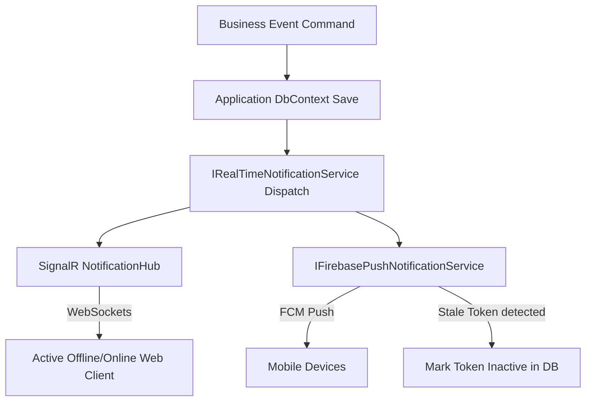

# FoodLoop Notification System Technical Specification

This document provides a comprehensive technical specification for the FoodLoop Notification System. It details the hybrid real-time WebSocket and push delivery architecture, authentication flows, error handling, token lifecycle management, and business event triggers.

---

## 1. Architectural Overview

The FoodLoop Notification System utilizes a hybrid delivery model to ensure low-latency, real-time message propagation alongside reliable mobile push notifications:



1.  **SignalR Real-Time Hub**: Provides persistent WebSocket channels to deliver instantaneous, in-app notifications directly to online clients.
2.  **Firebase Cloud Messaging (FCM)**: Delivers push notifications to Android and iOS mobile devices for background or offline users.

---

## 2. Authentication & Route Security

To prevent unauthorized access and protect user privacy, the notification hub and API endpoints are strictly secured:

### 2.1 Hub Connection Handshake
*   The `NotificationHub` is decorated with the `[Authorize]` attribute.
*   Since standard WebSockets do not support custom authorization headers during the initial handshake, the JWT bearer token is extracted from the connection query string inside [`InfrastructureServiceRegistration.cs`](file:///c:/ITI/server/src/FoodLoop.Infrastructure/DependencyInjection/InfrastructureServiceRegistration.cs):
    ```csharp
    options.Events = new JwtBearerEvents
    {
        OnMessageReceived = context =>
        {
            var accessToken = context.Request.Query["access_token"];
            var path = context.HttpContext.Request.Path;
            if (!string.IsNullOrEmpty(accessToken) && path.StartsWithSegments("/hubs/notifications"))
            {
                context.Token = accessToken;
            }
            return Task.CompletedTask;
        }
    };
    ```

### 2.2 Device Token Registration Endpoint
*   The `NotificationsController` is decorated with the `[Authorize]` attribute.
*   Token registration requires the client to present a valid Bearer Token.

---

## 3. Failure Isolation & Fault Tolerance

The system is designed under the principle of **strict failure isolation** to ensure that non-critical delivery issues do not impact primary business operations.

*   **Transactional Safety**: Database saves occur *before* notifications are triggered. If SignalR or Firebase throws an exception, the parent transaction remains committed and is not rolled back.
*   **Encapsulated Dispatch**: Both SignalR and Firebase calls are wrapped in individual `try-catch` blocks inside [`RealTimeNotificationService.cs`](file:///c:/ITI/server/src/FoodLoop.Infrastructure/Services/RealTimeNotificationService.cs):
    ```csharp
    try
    {
        await _hubContext.Clients.User(userId.ToString()).ReceiveNotification(dto);
    }
    catch (Exception ex)
    {
        _logger.LogError(ex, "SignalR real-time delivery failed for user {UserId}", userId);
    }
    ```

---

## 4. FCM Token Lifecycle & Database Cleanup

Device tokens are monitored continuously. Stale, invalid, or expired tokens are cleaned up dynamically during transmission failures.

### 4.1 Stale Token Detection
When sending messages via FCM, the SDK throws a `FirebaseMessagingException`. The [`FirebasePushNotificationService.cs`](file:///c:/ITI/server/src/FoodLoop.Infrastructure/Services/FirebasePushNotificationService.cs) catches this exception and inspects its error codes:
*   If `MessagingErrorCode` is `Unregistered` or `InvalidArgument` (or `ErrorCode` is `InvalidArgument`), the token is recognized as stale or invalid.
*   The system immediately marks the token record in the database as `IsActive = false`.

### 4.2 Non-Stale Failure Tolerance
If the exception corresponds to a transient error (e.g., `Internal`, `QuotaExceeded`, or `Unavailable`), the token's active status is **not** modified, allowing future retries once the service recovers.

### 4.3 Cleanup Strategy
*   **Flag-Only Deactivation:** Tokens are deactivated (`IsActive = false`) rather than hard-deleted. This preserves audit histories of user devices while ensuring no future network resources are wasted on dead registrations.

---

## 5. Multi-Tenant Isolation & Overlap Prevention

To prevent cross-tenant message leakage (e.g., when a user logs into a device previously used by someone else):
*   Registering a device token via [`UserDeviceTokenService.cs`](file:///c:/ITI/server/src/FoodLoop.Infrastructure/Services/UserDeviceTokenService.cs) automatically scans the database for the same token registered under any *other* user ID.
*   All duplicate tokens belonging to other user IDs are immediately flagged as `IsActive = false`.

---

## 6. Offline User Handling

*   **Real-time channels (SignalR/Firebase):** Handled as "fire-and-forget". If the user is offline or FCM delivery fails, the real-time messages are discarded on those channels.
*   **Database Inbox Fallback:** All dispatched notifications are persistently stored in the `Notifications` database table. Users can query their complete notification inbox history upon logging in or reconnecting.

---

## 7. Business Event Triggers & Dispatch Rules

The following table documents the active business events that trigger notifications, their target audience, and dispatch parameters:

| Business Event | Trigger Handler | Target Audience | Payload Category | Delivery Channels |
| :--- | :--- | :--- | :--- | :--- |
| **Support Ticket Reply** | `ReplyToSupportTicketCommandHandler` | Customer | `SupportTicketReply` | SignalR + Firebase |
| **Admin Note Sent** | `SendAdminNoteCommandHandler` | User | `AdminWarning` (if public) | SignalR + Firebase |
| **Order Placed** | `CreateOrderCommandHandler` | Customer | `OrderPlaced` | SignalR + Firebase |
| **Order Received** | `CreateOrderCommandHandler` | Merchant Owner | `OrderReceived` | SignalR + Firebase |
| **Order Status Updated**| `UpdateOrderStatusCommandHandler` | Customer | `OrderConfirmed` etc. | SignalR + Firebase |

### 7.1 Out-of-Scope Triggers
The following triggers are explicitly **out of scope** for the current release phase:
*   **AI Recommendations:** Staging, approvals, rejections, and auto-execution events do not trigger user notifications.
*   **Donations:** Donation listings, matches, and pickups do not trigger push or WebSocket notifications in the current sprint.
