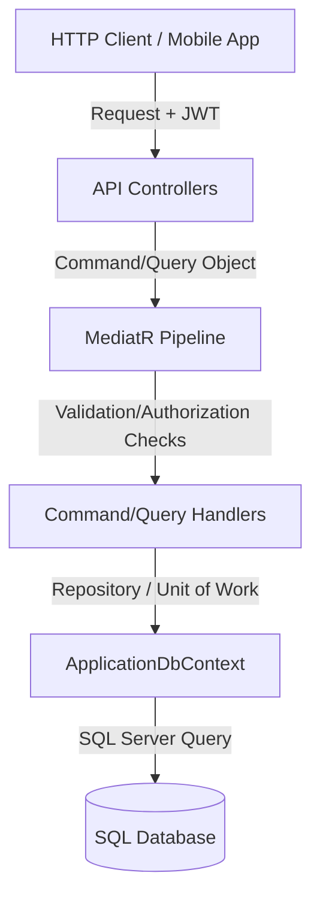

# FoodLoop Codebase Context Reference (System Architecture Blueprint)

This document serves as the primary system-wide architect reference for the FoodLoop backend. It defines tech stacks, database models, directory configurations, security strategies, and APIs to prevent hallucinated architecture.

---

## 1. Executive Overview & Tech Stack

*   **Framework**: .NET 10.0
*   **API Model**: Controller-based Web API (inheriting `ControllerBase` with automatic model validations).
*   **Architecture Pattern**: Clean Architecture with CQRS (Command Query Responsibility Segregation) implemented via the **MediatR** library.
*   **Database Providers**:
    *   **Production/Staging**: Microsoft SQL Server via EF Core.
    *   **Unit Tests**: SQLite in-memory provider.
*   **Key Packages & Dependencies**:
    *   `MediatR` — In-process CQRS messaging.
    *   `Microsoft.EntityFrameworkCore.SqlServer` — Relational database access.
    *   `Microsoft.AspNetCore.Identity.EntityFrameworkCore` — User identity & security tables.
    *   `Microsoft.AspNetCore.SignalR` — Real-time WebSockets push pipeline.
    *   `CloudinaryDotNet` — Dynamic file and media uploads.
    *   `Serilog.AspNetCore` — Structural diagnostics logging.

---

## 2. Project Structure & Directory Layout

The workspace is organized into four projects representing Clean Architecture layers:

```
c:\ITI\server\
├── src\
│   ├── FoodLoop.Domain\          # Pure entities, domain enums, value objects, domain logic (no outer refs)
│   ├── FoodLoop.Application\     # Common interfaces, DTO definitions, MediatR command/query contracts
│   ├── FoodLoop.Infrastructure\  # Persistence (DbContext, migrations), Repositories, Services, Handlers
│   └── FoodLoop.API\             # Controllers, startup (Program.cs), middlewares, settings (appsettings.json)
└── test\                         # xUnit unit and integration test assemblies (on test branch only)
```

---

## 3. Core Domain & Entity Relationship Mapping

Identity roles mapped in the system: `Admin`, `Merchant`, `Customer`, `Charity`.

### Entity Schemas & Relationships

| Entity / Aggregate | Key Relationships | Description |
| :--- | :--- | :--- |
| **ApplicationUser** | One-to-Many with `Address`, `RefreshToken`, `Favorite` | Represents account holders. Tied to an Identity role. |
| **Organization** | One-to-One with `ApplicationUser` (Owner), One-to-Many with `Product`, `Review` | Stores business details for Merchants or Charities. |
| **Product** | Many-to-One with `Organization`, Many-to-One with `Category` | Stock items. Tracks pricing, stock, and expiration. |
| **Order** | Many-to-One with `ApplicationUser`, One-to-Many with `OrderItem`, One-to-One with `Payment` | Cart checkout transactions. |
| **Review** | Many-to-One with `Organization`, One-to-One with `Order`, Many-to-One with `ApplicationUser` | Ratings & written comments left by Customers. |
| **SupportTicket** | Many-to-One with `ApplicationUser`, One-to-Many with `TicketMessage` | Customer support threads. |
| **Notification** | Many-to-One with `ApplicationUser` | Offline historic alerts stack. |
| **AuditLog** | Many-to-One with `ApplicationUser`, Many-to-One with `Organization` | Tracks security, profile, and ordering events. |

---

## 4. Database & Persistence (`DbContext`)

*   **DbContext**: `ApplicationDbContext` (inherits `IdentityDbContext<ApplicationUser, ApplicationRole, Guid>`).
*   **Custom Table Mappings**: Default ASP.NET Identity tables are mapped to clean names:
    *   `AspNetUsers` ➡️ `Users`
    *   `AspNetRoles` ➡️ `Roles`
    *   `AspNetUserRoles` ➡️ `UserRoles`
    *   `AspNetUserClaims` ➡️ `UserClaims`
    *   `AspNetUserLogins` ➡️ `UserLogins`
    *   `AspNetRoleClaims` ➡️ `RoleClaims`
    *   `AspNetUserTokens` ➡️ `UserTokens`

### Interceptors & Save Hooks
*   **Temporal Audits**: Automatically stamps `CreatedAt` and `UpdatedAt` values for entities inheriting `BaseEntity`.
*   **Soft Deletes**: Intercepts deletions on entities implementing `ISoftDelete` (e.g. `Product`), transforming them into update commands that toggle `IsDeleted = true` and record `DeletedAt`.

---

## 5. API Endpoints & Contracts

### 🔐 Authentication (`/auth`)
*   `POST /auth/register` ➡️ Registers a new user account.
    *   *Request*: `RegisterDto` (name, email, password, role, businessName).
    *   *Response*: Details of the draft user with status `PendingVerification`.
*   `POST /auth/login` ➡️ Validates credentials. Returns an JWT `accessToken` (if verified) and `refreshToken`.
*   `POST /auth/refresh` ➡️ Rotates session tokens.
    *   *Request*: `{ "refreshToken": "..." }`.
    *   *Response*: New access and refresh tokens.
*   `POST /auth/logout` ➡️ Inactivates the refresh token session.
*   `POST /auth/forgot-password` ➡️ Generates a password reset token.
*   `POST /auth/reset-password` ➡️ Updates the password using the reset token.
*   `POST /auth/resend-verification` ➡️ Resends signup verification instructions.

### 🧑‍💼 User Profiles & Addresses (`/users`)
*   `GET /users/me` ➡️ Returns current user profile details.
*   `PATCH /users/me` ➡️ Updates user profile details (name, profile picture, language).
*   `PATCH /users/me/preferences` ➡️ Modifies email, push, and marketing preferences.
*   `GET /users/me/addresses` ➡️ Lists all saved delivery/pickup addresses.
*   `POST /users/me/addresses` ➡️ Creates a new address (label, city, district, lat, long, building, floor, default-status).
*   `PATCH /users/me/addresses/{id}` ➡️ Modifies an existing address.
*   `DELETE /users/me/addresses/{id}` ➡️ Deletes an address.

### 🏪 Stores / Organizations (`/stores` & `/charities`)
*   `GET /stores/me` ➡️ Returns current merchant organization profile details.
*   `PATCH /stores/me` ➡️ Updates merchant organization parameters (multipart form-data: Name, Category, Logo, Phone, OpeningHours).
*   `PATCH /stores/me/location` ➡️ Updates physical coordinates (latitude, longitude) and street details.
*   `POST /stores/me/documents` ➡️ Uploads verification documents (multipart form-data: Email, Type, File).
*   `GET /stores/me/orders` ➡️ Returns orders received by the store.
*   `PATCH /stores/me/orders/{id}/status` ➡️ Updates received order status (`Confirmed`, `Preparing`, `ReadyForPickup`, `Completed`, `Cancelled`).
*   `POST /charities/me/documents` ➡️ Uploads verification documents for charities.

### 📦 Merchant Inventory (`/stores/me/products`)
*   `POST /stores/me/products` ➡️ Adds a new product to inventory.
    *   *Request*: `CreateProductDto` (categoryId, title, description, originalPrice, discountedPrice, quantityAvailable, expirationDate).
*   `GET /stores/me/products` ➡️ Lists store's inventory products.
*   `GET /stores/me/products/{id}` ➡️ Returns specific product details.
*   `PATCH /stores/me/products/{id}` ➡️ Updates inventory parameters (discounted price, stock, status).
*   `DELETE /stores/me/products/{id}` ➡️ Soft-deletes a product.
*   `POST /stores/me/products/{id}/images` ➡️ Uploads product image to Cloudinary (multipart: file).
*   `DELETE /stores/me/products/{id}/images/{imageId}` ➡️ Deletes product image association.
*   `POST /stores/me/products/bulk` ➡️ Imports products in bulk from a CSV file (multipart: file).

### 🗺️ Public Marketplace (`/marketplace`)
*   `GET /marketplace/products` ➡️ Returns active products within physical distance limits.
    *   *Query*: `latitude`, `longitude`, `maxDistance` (km), `sortBy=distance`, `categoryId`, `searchTerm`.
    *   *Logic*: Computes physical distances dynamically using the **Haversine Formula**. Excludes unverified stores, inactive accounts, and expired products.

### 🛒 Orders & Checkout (`/orders`)
*   `POST /orders` ➡️ Submits cart items for purchase.
    *   *Request*: `{ "items": [{ "productId": "...", "quantity": 2 }] }`.
    *   *Logic*: Deducts stock atomically, simulates payment, logs events, and fires SignalR notifications.
*   `GET /orders` ➡️ Returns customer order history.
*   `GET /orders/{id}` ➡️ Returns detailed order info.

### ⭐ Store Reviews (`/reviews`)
*   `POST /reviews` ➡️ Customer submits a review for a completed order.
*   `GET /stores/{id}/reviews` ➡️ Public reviews feed for a store.

### 🔔 Notifications Feed (`/notifications`)
*   `GET /notifications` ➡️ Lists customer or merchant historical notifications.
*   `PATCH /notifications/{id}/read` ➡️ Marks a single alert as read.
*   `PATCH /notifications/read-all` ➡️ Marks all user notifications as read.

### 🎫 Customer Support (`/support-tickets`)
*   `POST /support-tickets` ➡️ Customer opens a support ticket.
*   `GET /support-tickets` ➡️ Lists customer support tickets.
*   `GET /support-tickets/{id}` ➡️ Returns support conversation details.
*   `POST /support-tickets/{id}/reply` ➡️ Customer posts a reply message.

### 🛡️ Admin Dashboard (`/admin`)
*   `GET /admin/stores/pending` / `GET /admin/charities/pending` ➡️ Verification queues.
*   `PATCH /admin/stores/{id}/verify` / `PATCH /admin/charities/{id}/verify` ➡️ Approve/Reject onboarding organizations.
*   `PATCH /admin/users/{id}/status` ➡️ Ban/Suspend user profiles.
*   `GET /admin/users/{id}/activity-log` ➡️ Audit logs.
*   `GET /admin/analytics/summary` ➡️ System metrics (revenue, environmental savings).
*   `DELETE /admin/reviews/{id}` ➡️ Delete / moderate store reviews.
*   `DELETE /admin/products/{id}` ➡️ Terminate/Moderate products globally.
*   `POST /admin/support-tickets/{id}/reply` ➡️ Support agent replies to a ticket.

---

## 6. Application Logic & Data Flow



### Key Infrastructure Middlewares & Handlers
*   **Exception Handling Middleware**: Catch-all handler (`ExceptionHandlingMiddleware`) returning structured error payloads (`ApiResponse.Fail(...)`) and mapping custom domain exceptions to correct HTTP status codes (e.g. `NotFoundException` ➡️ `404 Not Found`).
*   **Real-time Hub**: Mapped to `/hubs/notifications`, utilizing strongly typed `NotificationHub` and real-time pushes via `IRealTimeNotificationService`.

---

## 7. Authentication, Authorization & Security

*   **Strategy**: JWT (JSON Web Token) Bearer authentication.
*   **WebSocket Handshake Authorization**: Reads the JWT from the `access_token` query parameter when connecting to SignalR, bypasses browser header limits:
    ```csharp
    options.Events = new JwtBearerEvents {
        OnMessageReceived = context => {
            var accessToken = context.Request.Query["access_token"];
            if (!string.IsNullOrEmpty(accessToken) && context.Request.Path.StartsWithSegments("/hubs")) {
                context.Token = accessToken;
            }
            return Task.CompletedTask;
        }
    };
    ```
*   **Verification Filter**: Unverified merchants/charities have their access tokens cleared at login, blocking API execution until approved by an Admin.

---

## 8. Configuration Schema (`appsettings.json` / `.env`)

```json
{
  "ConnectionStrings": {
    "DefaultConnection": "Server=YOUR_SERVER;Database=YOUR_DB;User Id=YOUR_USER;Password=YOUR_PASSWORD;Encrypt=True;TrustServerCertificate=True;MultipleActiveResultSets=True;"
  },
  "Jwt": {
    "Issuer": "FoodLoop.API",
    "Audience": "FoodLoop.Clients",
    "Secret": "A_MINIMUM_32_CHARACTER_CRYPTOGRAPHIC_SECURITY_KEY_HERE",
    "AccessTokenExpirationMinutes": 15,
    "RefreshTokenExpirationDays": 30
  },
  "Cors": {
    "AllowedOrigins": [
      "http://localhost:3000",
      "http://localhost:5173",
      "https://web-nine-ivory-36.vercel.app",
      "https://foodloop.runasp.net"
    ]
  },
  "AiService": {
    "BaseUrl": "http://3.94.7.125:8000",
    "TimeoutSeconds": 60
  },
  "MonitoringScanner": {
    "IntervalMinutes": 60,
    "ExpirationThresholdDays": 3,
    "VelocityThresholdMultiplier": 0.8
  },
  "AiPricingBatch": {
    "IntervalMinutes": 60
  },
  "HistoricalIngestion": {
    "IntervalMinutes": 60,
    "BatchSize": 100
  },
  "Gemini": {
    "ApiKey": "YOUR_GEMINI_API_KEY",
    "Model": "gemini-1.5-flash"
  },
  "Paymob": {
    "BaseUrl": "https://accept.paymob.com",
    "ApiKey": "YOUR_PAYMOB_API_KEY",
    "IntegrationId": "5855304",
    "IframeId": "1069687",
    "PublicKey": "YOUR_PAYMOB_PUBLIC_KEY",
    "HmacSecret": "YOUR_PAYMOB_HMAC_SECRET"
  },
  "Firebase": {
    "Enabled": false,
    "ProjectId": "YOUR_PROJECT_ID",
    "ServiceAccountJson": ""
  }
}
```

*Note: Environment variables loaded from `.env` or system environment variables automatically override `appsettings.json` in production.*

---

## 9. Documentation Index (`/docs`)

All technical specifications, endpoint maps, and testing guides are organized in the [`docs/`](file:///c:/ITI/server/docs/) directory:

| **Screens Visual Gallery** | [`Screens/README.md`](file:///c:/ITI/server/Screens/README.md) | Visual catalog with embedded screenshots of all 59 UI screens. |
| **Screens to Endpoints Map** | [`docs/screens-to-endpoints.md`](file:///c:/ITI/server/docs/screens-to-endpoints.md) | UI screen-to-API routing and method mapping. |
| **Backend Architecture** | [`docs/backend-architecture.md`](file:///c:/ITI/server/docs/backend-architecture.md) | Clean Architecture layers, CQRS with MediatR, and persistence. |
| **Complete API Testing Guide** | [`docs/api_testing_guide.md`](file:///c:/ITI/server/docs/api_testing_guide.md) | Endpoint testing manual with payloads for all controllers. |
| **Notification Specification** | [`docs/notifications-spec.md`](file:///c:/ITI/server/docs/notifications-spec.md) | Hybrid SignalR WebSocket & FCM push, write-time localization. |
| **Payment Specification** | [`docs/payment-spec.md`](file:///c:/ITI/server/docs/payment-spec.md) | Paymob Unified Checkout, Webhooks, Wallet balance, and Refunds. |
| **Authentication Flow** | [`docs/auth-flow.md`](file:///c:/ITI/server/docs/auth-flow.md) | Multi-role registration, JWT token rotation, and verification gates. |
| **Data Storage Schema** | [`docs/data-storage.md`](file:///c:/ITI/server/docs/data-storage.md) | Relational database schema, indexes, and soft-delete policies. |
| **AI Role & Architecture** | [`docs/ai-role.md`](file:///c:/ITI/server/docs/ai-role.md) | Dual-agent LangGraph architecture, LLM reasoning, RAG vector store, and margin shields. |
| **Verification & Step Reports**| [`docs/reports/`](file:///c:/ITI/server/docs/reports/) | Step-by-step test reports and cross-service audit logs. |

---

## 10. Automated Test Suite

Run the full test suite across all layers:
```powershell
dotnet test
```
*   **Total Tests**: **497 / 497 Passing (100% Green)**
    *   `FoodLoop.Domain.Tests`: 28 tests (100% passing)
    *   `FoodLoop.Application.Tests`: 11 tests (100% passing)
    *   `FoodLoop.Infrastructure.Tests`: 458 tests (100% passing)


