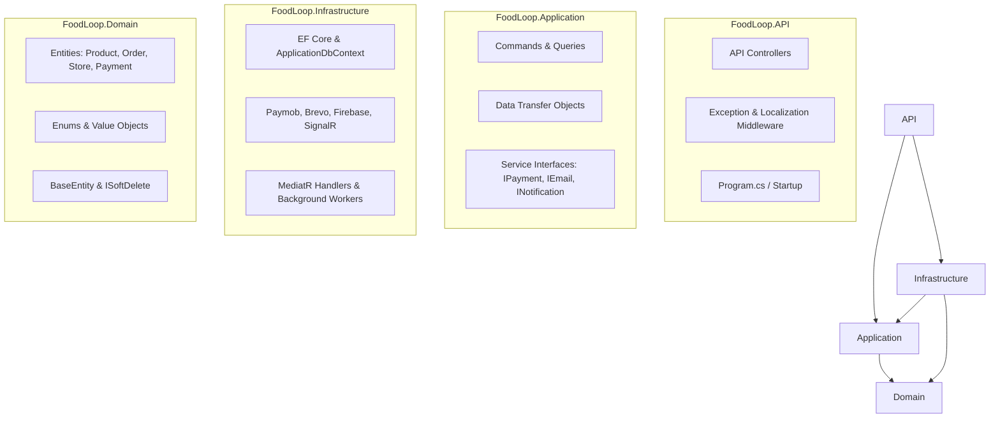

# 🎬 FoodLoop Backend Video Showcase Guide & Script

This document serves as the complete presentation blueprint, speaking script, visual demonstration plan, and technical showcase guide for recording the **FoodLoop Backend Video**.

---

## ⏱️ Video Structure & Timeline (Estimated ~7 to 10 Minutes)

| Scene | Topic / Module | Key Focus Areas | Code / Visuals to Show | Est. Time |
| :---: | :--- | :--- | :--- | :---: |
| **1** | **Introduction & Overview** | Problem domain, high-level tech stack, test suite | Terminal running `dotnet test`, Swagger UI | 0:45 |
| **2** | **Clean Architecture** | 4-layer separation of concerns, dependency rule | Solution Explorer tree, Project dependencies | 1:15 |
| **3** | **CQRS Pattern with MediatR** | Decoupled commands/queries, thin controllers, request pipeline | `CreateOrderCommand`, Handler, Controller | 1:15 |
| **4** | **Database & Persistence** | EF Core 10, table schemas, soft delete, audit interceptor | SSMS/DBeaver schema, `ApplicationDbContext` | 1:30 |
| **5** | **Payment & Wallet Subsystem** | Paymob Accept v4, HMAC SHA-256 validation, 2-layer idempotency | `PaymobService.cs`, HMAC method, Unique Index | 1:30 |
| **6** | **Hybrid Notification System** | SignalR WebSockets + Firebase Cloud Messaging (FCM) | `RealTimeNotificationService.cs`, `NotificationHub` | 1:00 |
| **7** | **Email Service Provider** | `IEmailService` abstraction (Brevo API + SMTP) | `BrevoEmailService.cs`, `SmtpEmailService.cs` | 0:45 |
| **8** | **AI Integration & Hosted Services** | 3 .NET Background Services, Gemini OCR, Price Floor Shield | `PricingBatchHostedService.cs`, `PriceFloorCalculator.cs` | 1:00 |
| **9** | **Containerization & Deployment** | Multi-stage Dockerfile, docker-compose, config management | `Dockerfile`, `docker-compose.yml`, Live Swagger | 0:45 |
| **10** | **Conclusion & Summary** | Key engineering achievements, robustness & scalability | Full Solution overview, Thank you slide | 0:30 |

---

## 🖥️ Pre-Recording Preparation Checklist

Before starting the screen recording, prepare and open the following windows:
1. **IDE (Visual Studio / VS Code / JetBrains Rider)**:
   - Solution `FoodLoop.sln` loaded with all 4 projects expanded.
   - Zoom in editor font size (`Ctrl + +`) for crisp readability on video.
2. **Terminal / Command Prompt**:
   - Navigate to `c:\ITI\server` and have `dotnet test` ready to run.
3. **Swagger UI**:
   - Open browser tab at `http://localhost:8080/swagger` (or live deployment) with all 14 controllers visible.
4. **Database Visualizer (SSMS / Azure Data Studio / DBeaver)**:
   - Connected to the database with tables list and an ER Diagram / Table View ready.
5. **Docker / Container View (Optional but recommended)**:
   - Docker Desktop or terminal ready to show the running container.

---

# 📜 Scene-by-Scene Script & Demonstration Plan

---

### 🎬 Scene 1: Introduction & Executive Overview

#### 🎯 Visual on Screen:
- Start with Swagger UI or IDE with Terminal open.
- Run `dotnet test` live in the terminal to display **497 passing tests (100% Green)** across Domain, Application, and Infrastructure layers.

```powershell
dotnet test
# Passed! - Failed: 0, Passed: 497, Skipped: 0, Total: 497
```

#### 🗣️ Voiceover Script:
> *"Hello everyone. Today, we are presenting the backend architecture, design patterns, and engineering workflows for **FoodLoop** — an enterprise-grade surplus food redistribution marketplace built on **.NET 10**.*
>
> *Our goal on the backend was to construct a highly resilient, scalable, and deterministic system capable of orchestrating multi-role accounts, real-time location-based marketplace filtering, automated AI pricing cycles, secure online payments, and hybrid notifications.*
>
> *As you can see, the solution is built with strict test-driven quality, featuring 497 automated unit and integration tests passing with 100% green coverage across all layers."*

---

### 🎬 Scene 2: Clean Architecture & Layer Responsibilities

#### 🎯 Visual on Screen:
- Expand the 4 projects in the Solution Explorer:
  - `src/FoodLoop.Domain`
  - `src/FoodLoop.Application`
  - `src/FoodLoop.Infrastructure`
  - `src/FoodLoop.API`
- Open [`FoodLoop.Domain/Common/BaseEntity.cs`](file:///c:/ITI/server/src/FoodLoop.Domain/Common/BaseEntity.cs) and [`FoodLoop.API/Program.cs`](file:///c:/ITI/server/src/FoodLoop.API/Program.cs).

#### 🏛️ Architecture Flow Diagram:


#### 🗣️ Voiceover Script:
> *"We implemented a strict **Clean Architecture (Onion Architecture)** approach, ensuring clear separation of concerns and dependency inversion:*
> 
> 1. * **Domain Layer**: Contains enterprise business models (`Product`, `Order`, `Organization`, `Payment`) and enums with zero external dependencies.*
> 2. * **Application Layer**: Defines our business use cases, MediatR command and query contracts, DTOs, and abstract service contracts (`IPaymentService`, `IEmailService`, `IRealTimeNotificationService`).*
> 3. * **Infrastructure Layer**: Implements technical concerns — EF Core 10 database persistence, Paymob gateway SDK, Firebase Cloud Messaging, and SignalR WebSocket hubs.*
> 4. * **API Layer**: Acts strictly as the HTTP presentation entry point, configuring dependency injection, middleware pipelines, and JWT authentication."*

---

### 🎬 Scene 3: CQRS Pattern with MediatR

#### 🎯 Visual on Screen:
- Split editor view showing:
  - Left: Command Contract — [`CreateOrderCommand.cs`](file:///c:/ITI/server/src/FoodLoop.Application/Features/Orders/Commands/CreateOrderCommand.cs)
  - Right: Handler Logic — [`CreateOrderCommandHandler.cs`](file:///c:/ITI/server/src/FoodLoop.Infrastructure/Features/Orders/Commands/CreateOrderCommandHandler.cs)
  - Controller: [`OrdersController.cs`](file:///c:/ITI/server/src/FoodLoop.API/Controllers/OrdersController.cs)

#### 🗣️ Voiceover Script:
> *"To ensure maintainability and high cohesion, we adopted the **CQRS (Command Query Responsibility Segregation)** pattern implemented through **MediatR**.*
>
> *Every single operation is isolated into a dedicated Command for writes or Query for reads:*
> * *Our controllers are completely free of business logic. They simply accept the HTTP request and dispatch a MediatR command.*
> * *The Command Handler orchestrates atomic database transactions via `IUnitOfWork`, validates business constraints, updates stock atomically, and fires real-time domain events without polluting the API layer.*
> * *Responses are wrapped in standardized `Result<T>` and `ApiResponse<T>` envelopes for predictable client communication."*

---

### 🎬 Scene 4: Database Design, Schema & Persistence (EF Core 10)

#### 🎯 Visual on Screen:
- Show SSMS / DBeaver / ER diagram of tables or open [`ApplicationDbContext.cs`](file:///c:/ITI/server/src/FoodLoop.Infrastructure/Persistence/ApplicationDbContext.cs).
- Highlight key tables:
  - `Users`, `Roles`, `RefreshTokens`
  - `Stores`, `StoreVerifications`
  - `ProductListings`, `ProductImages`, `AIRecognitionResults`
  - `Orders`, `OrderItems`, `Payments`, `WalletTransactions`
  - `Notifications`, `AuditLogs`, `SupportTickets`

#### 🗣️ Voiceover Script:
> *"Our persistence layer uses **Microsoft SQL Server** orchestrated with **EF Core 10**.*
> 
> *Key architectural patterns in our database design include:*
> 1. * **Automatic Audit Stamping**: Every entity inheriting from `BaseEntity` has its `CreatedAt`, `UpdatedAt`, and user tracking properties automatically populated in `ApplicationDbContext.SaveChangesAsync`.*
> 2. * **Global Soft Deletes**: Deleting records that implement `ISoftDelete` (such as `ProductListings` and `Stores`) never physically drops rows; instead, EF Core intercepts deletions to toggle `IsDeleted = true` and applies automatic global query filters.*
> 3. * **Spatial Haversine Geo-Queries**: The marketplace endpoint queries proximity by dynamically computing physical distance (in km) between the customer's coordinates and store locations.*
> 4. * **Clean ASP.NET Identity Mapping**: We customized the default Identity table schema to clean names (`Users`, `Roles`, `UserRoles`)."*

---

### 🎬 Scene 5: Payment Gateway & In-App Wallet (Paymob Accept v4)

#### 🎯 Visual on Screen:
- Open [`FoodLoop.Infrastructure/Services/PaymobService.cs`](file:///c:/ITI/server/src/FoodLoop.Infrastructure/Services/PaymobService.cs) or [`PaymentsController.cs`](file:///c:/ITI/server/src/FoodLoop.API/Controllers/PaymentsController.cs).
- Zoom in on the HMAC SHA-256 signature verification method.

#### 🛡️ Payment Flow & Idempotency Architecture:
```mermaid
graph TD
    Client[Customer Checkout] -->|POST /orders/{id}/paymob-checkout| API[Payments Controller]
    API -->|Init Unified Checkout| Paymob[Paymob Accept v4 Gateway]
    Paymob -->|Client Completes Payment| Paymob
    Paymob -->|Webhook Callback| Callback[POST /payments/paymob-callback]
    
    subgraph Webhook Security & Idempotency
        Callback --> HMAC[1. HMAC-SHA256 17-Field Signature Validation]
        HMAC --> L1[2. Layer 1 Check: Pre-Query Existing Transaction]
        L1 --> L2[3. Layer 2 Check: DB Unique Index on TransactionReference]
        L2 --> Process[4. Mark Order Paid + Allocate Wallet Ledger]
    end
```

#### 🗣️ Voiceover Script:
> *"For payment processing, we integrated **Paymob Accept v4** to support cards, digital wallets, and cash on delivery.*
>
> *We implemented enterprise-grade security and idempotency safeguards:*
> 1. * **HMAC SHA-256 Cryptographic Verification**: Webhook callbacks concatenate 17 distinct transaction fields in exact order and validate against timing attacks using `CryptographicOperations.FixedTimeEquals`.*
> 2. * **Two-Layer Idempotency Architecture**: To prevent double-crediting from network retries, we enforce a pre-query check in software followed by a hard **Unique Index constraint** on `TransactionReference` in SQL Server.*
> 3. * **Wallet & Refund Engine**: The backend maintains an internal wallet ledger (`WalletTransactions`) for automated order cancellations, dispute payouts, and merchant commission reconciliations."*

---

### 🎬 Scene 6: Hybrid Real-Time & Push Notification Subsystem

#### 🎯 Visual on Screen:
- Open [`FoodLoop.Infrastructure/Services/RealTimeNotificationService.cs`](file:///c:/ITI/server/src/FoodLoop.Infrastructure/Services/RealTimeNotificationService.cs) and [`FirebasePushNotificationService.cs`](file:///c:/ITI/server/src/FoodLoop.Infrastructure/Services/FirebasePushNotificationService.cs).
- Show the JWT query parameter token extractor in [`InfrastructureServiceRegistration.cs`](file:///c:/ITI/server/src/FoodLoop.Infrastructure/DependencyInjection/InfrastructureServiceRegistration.cs).

#### 🗣️ Voiceover Script:
> *"We engineered a **hybrid notification delivery system** combining real-time WebSockets and mobile push:*
> 
> 1. * **SignalR Hub (`/hubs/notifications`)**: Pushes instant notifications to active web and app sessions. We customized the JWT pipeline to extract tokens from WebSocket handshake query strings.*
> 2. * **Firebase Cloud Messaging (FCM)**: Sends push notifications to mobile devices when users are offline or in the background.*
> 3. * **Failure Isolation**: Notification dispatches are safely wrapped in try-catch blocks so third-party network drops never roll back committed business transactions.*
> 4. * **Dead Token Invalidation**: When FCM returns `Unregistered` or `InvalidArgument`, the system immediately deactivates the stale token in the database to prevent wasted network traffic."*

---

### 🎬 Scene 7: Email Service Provider Subsystem

#### 🎯 Visual on Screen:
- Open [`IEmailService.cs`](file:///c:/ITI/server/src/FoodLoop.Application/Common/Interfaces/IEmailService.cs) and [`BrevoEmailService.cs`](file:///c:/ITI/server/src/FoodLoop.Infrastructure/Services/BrevoEmailService.cs).

#### 🗣️ Voiceover Script:
> *"For transactional email notifications, we decoupled our provider behind the `IEmailService` interface.*
> 
> *We implemented **Brevo (Sendinblue) REST API** integration as our primary provider alongside a standard **SMTP provider** and a **NullEmailService** for mock testing. The service handles branded account verification emails, password reset flows with cryptographically signed tokens, and merchant onboarding decision alerts."*

---

### 🎬 Scene 8: AI Integration & Background Hosted Services

#### 🎯 Visual on Screen:
- Open the BackgroundServices folder:
  - [`MonitoringScannerHostedService.cs`](file:///c:/ITI/server/src/FoodLoop.Infrastructure/BackgroundServices/MonitoringScannerHostedService.cs)
  - [`PricingBatchHostedService.cs`](file:///c:/ITI/server/src/FoodLoop.Infrastructure/BackgroundServices/PricingBatchHostedService.cs)
  - [`HistoricalIngestionHostedService.cs`](file:///c:/ITI/server/src/FoodLoop.Infrastructure/BackgroundServices/HistoricalIngestionHostedService.cs)
- Show [`PriceFloorCalculator.cs`](file:///c:/ITI/server/src/FoodLoop.Infrastructure/Features/AiIntegration/PriceFloorCalculator.cs).

#### 🗣️ Voiceover Script:
> *"FoodLoop features automated background intelligence using .NET 10 **`IHostedService`** background workers:*
> 
> 1. * **`MonitoringScannerHostedService`**: Continuously monitors inventory expiry dates and dispatches high-risk items to the AI pipeline.*
> 2. * **`PricingBatchHostedService`**: Communicates with our dedicated AI microservice to calculate optimal dynamic markdown discounts.*
> 3. * **`HistoricalIngestionHostedService`**: Ingests completed sales episodes into our **Qdrant Vector Database** for RAG intelligence.*
> 4. * **Financial Safety Shield**: Raw AI predictions are never blindly applied to the database. The .NET backend evaluates `PriceFloorCalculator` to ensure discounts never violate merchant minimum margin thresholds."*

---

### 🎬 Scene 9: Containerization, CI/CD & Deployment

#### 🎯 Visual on Screen:
- Open [`Dockerfile`](file:///c:/ITI/server/Dockerfile) and [`docker-compose.yml`](file:///c:/ITI/server/docker-compose.yml).
- Show the live deployment Swagger or production URL.

#### 🗣️ Voiceover Script:
> *"For deployment, we containerized the backend with a **multi-stage Docker build**:*
> * *Stage 1 uses the .NET 10 SDK with layer-cached project restore for high-speed compilation.*
> * *Stage 2 copies only published binaries to a lightweight ASP.NET 10 production runtime.*
> *Environment settings, JWT secrets, and connection strings are cleanly injected via `.env` and environment variables, with full CORS origin restrictions in production."*

---

### 🎬 Scene 10: Conclusion & Wrap-Up

#### 🎯 Visual on Screen:
- Return to the complete solution view in your IDE or Swagger UI.

#### 🗣️ Voiceover Script:
> *"In conclusion, the FoodLoop backend demonstrates a production-ready, clean, and robust architecture:*
> * *4-layer Clean Architecture with CQRS and MediatR.*
> * *Comprehensive SQL Server schema with audit logs and soft deletes.*
> * *Secure Paymob payment processing with HMAC validation and idempotency.*
> * *Hybrid real-time SignalR and FCM notifications.*
> * *497 passing tests backing every layer.*
>
> *Thank you for your time!"*

---

## 💡 Practical Recording Tips

1. **Font Size**: Zoom in your IDE editor font (`Ctrl + Wheel` or `Ctrl + +`) so viewers on laptops and phones can easily read method names.
2. **Tab Organization**: Keep your tabs pre-opened in the exact order of the script (1. Program.cs $\rightarrow$ 2. Command/Handler $\rightarrow$ 3. DbContext $\rightarrow$ 4. PaymobService $\rightarrow$ 5. RealTimeNotificationService $\rightarrow$ 6. BackgroundServices $\rightarrow$ 7. Dockerfile).
3. **Cursor Highlighting**: When speaking about a specific method (e.g. HMAC verification or PriceFloor validation), highlight the block with your mouse so the viewer's eye follows naturally.
4. **Pacing**: Speak at a clear, measured pace. Take a short 1-second pause between sections so you can edit cuts seamlessly if needed.
