# 🗄️ FoodLoop Platform — Comprehensive Entity Relationship Diagram (ERD) & Database Specification

This document provides the complete technical specification, architectural mapping, and Mermaid Entity Relationship Diagram (ERD) for the **FoodLoop** relational database persistence layer (`ApplicationDbContext`).

---

## 1. 📊 Complete Visual Mermaid ERD

```mermaid
erDiagram
    %% ==========================================
    %% 1. IDENTITY & USER MANAGEMENT
    %% ==========================================
    Users ||--o{ UserRoles : "has"
    Roles ||--o{ UserRoles : "assigned_to"
    Users ||--o{ RefreshTokens : "owns"
    Users ||--o{ UserDeviceTokens : "registers"
    Users ||--o{ Addresses : "resides_at"
    Users ||--o{ WalletTransactions : "transacts"
    Users ||--o{ Favorites : "favorites"
    Users ||--o{ Reviews : "authors"
    Users ||--o{ Notifications : "receives"
    Users ||--o{ SupportTickets : "opens"
    Users ||--o{ ProductReports : "submits"
    Users ||--o{ AuditLogs : "triggers"
    Users ||--o{ AdminNotes : "receives_or_targeted"

    %% ==========================================
    %% 2. ORGANIZATIONS (STORES & CHARITIES)
    %% ==========================================
    Users ||--o{ Organizations : "owns/manages"
    Organizations ||--o{ OrganizationVerifications : "submits_docs"
    Organizations ||--o{ Addresses : "located_at"
    Organizations ||--o{ Products : "catalogs"
    Organizations ||--o{ Orders : "fulfills"
    Organizations ||--o{ Favorites : "favorited_by"
    Organizations ||--o{ Reviews : "reviewed_by"
    Organizations ||--o{ Donations : "donates_given"
    Organizations ||--o{ Donations : "donates_received"
    Organizations ||--o{ AiPricingRecommendations : "receives_pricing"
    Organizations ||--o{ AIRecognitionResults : "runs_ocr"
    Organizations ||--o{ AuditLogs : "scoped_to"
    Organizations ||--o{ AdminNotes : "targeted"

    %% ==========================================
    %% 3. CATALOG & INVENTORY SUBSYSTEM
    %% ==========================================
    Categories ||--o{ Products : "categorizes"
    Products ||--o{ ProductImages : "displays"
    Products ||--o{ PriceHistories : "audits_prices"
    Products ||--o{ OrderItems : "ordered_in"
    Products ||--o{ ProductReports : "reported_for"
    Products ||--o{ AIRecognitionResults : "extracted_from"
    Products ||--o{ AiRiskAssessments : "evaluated_by"
    Products ||--o{ AiPricingRecommendations : "priced_by"
    Products ||--o{ ProductPricingEpisodes : "produces_episodes"

    %% ==========================================
    %% 4. ORDERS & PAYMENTS
    %% ==========================================
    Users ||--o{ Orders : "places"
    Orders ||--|{ OrderItems : "contains"
    Orders ||--o{ Payments : "settled_via"
    Orders ||--o{ Reviews : "reviewed_in"
    Orders ||--o{ WalletTransactions : "debited_by"

    %% ==========================================
    %% 5. AI ENGINE & INTELLIGENCE
    %% ==========================================
    AiRiskAssessments ||--o| AiPricingRecommendations : "stages"

    %% ==========================================
    %% 6. CUSTOMER SUPPORT & TICKETING
    %% ==========================================
    SupportTickets ||--|{ TicketMessages : "threads"
    Users ||--o{ TicketMessages : "sends"

    %% ==========================================
    %% ENTITY ATTRIBUTE DEFINITIONS
    %% ==========================================

    Users {
        guid Id PK
        string FullName
        string Email
        string UserName
        string PhoneNumber
        string Language
        string ProfileImage
        int Status "UserStatus Enum"
        decimal WalletBalance "Precision(18,2)"
        bool OrderUpdatesEnabled
        bool MarketingNotificationsEnabled
        datetimeoffset CreatedAt
        datetimeoffset UpdatedAt
    }

    Roles {
        guid Id PK
        string Name
        string NormalizedName
    }

    UserRoles {
        guid UserId PK,FK
        guid RoleId PK,FK
    }

    RefreshTokens {
        guid Id PK
        guid UserId FK
        string Token
        datetimeoffset ExpiresAt
        datetimeoffset CreatedAt
        datetimeoffset RevokedAt
        string ReplacedByToken
    }

    UserDeviceTokens {
        guid Id PK
        guid UserId FK
        string DeviceToken
        string Platform
        datetimeoffset LastUsedAt
    }

    Addresses {
        guid Id PK
        guid UserId FK "Nullable"
        guid OrganizationId FK "Nullable"
        string Street
        string City
        string State
        string PostalCode
        string Country
        double Latitude
        double Longitude
        bool IsDefault
        string Label
    }

    Organizations {
        guid Id PK
        guid OwnerId FK
        string Name
        string Description
        string LogoUrl
        string CoverImageUrl
        int Type "OrganizationType Enum (Store, Charity)"
        int AiOperatingMode "AiOperatingMode Enum (Manual, Assisted, Autonomous)"
        int AiPriceFloorPolicy "PriceFloorPolicy Enum (DynamicAi, Fixed30Percent, Fixed50Percent)"
        bool IsVerified
        decimal CommissionBalance "Precision(18,2)"
        bool IsDeleted
        datetimeoffset DeletedAt
        datetimeoffset CreatedAt
        datetimeoffset UpdatedAt
    }

    OrganizationVerifications {
        guid Id PK
        guid OrganizationId FK
        string DocumentType
        string DocumentUrl
        int Status "VerificationStatus Enum"
        guid ReviewedBy FK "Nullable"
        datetimeoffset ReviewedAt
        string RejectionReason
        datetimeoffset CreatedAt
    }

    Categories {
        guid Id PK
        string Name
        string Description
        string IconUrl
        int DisplayOrder
        datetimeoffset CreatedAt
    }

    Products {
        guid Id PK
        guid OrganizationId FK
        guid CategoryId FK
        string Title
        string Description
        decimal OriginalPrice "Precision(18,2)"
        decimal DiscountedPrice "Precision(18,2)"
        int QuantityAvailable
        date ExpirationDate
        int Status "ProductStatus Enum"
        bool IsMysteryBag
        string Barcode
        bool IsDeleted
        datetimeoffset DeletedAt
        datetimeoffset CreatedAt
        datetimeoffset UpdatedAt
    }

    ProductImages {
        guid Id PK
        guid ProductId FK
        string ImageUrl
        int DisplayOrder
        datetimeoffset CreatedAt
    }

    PriceHistories {
        guid Id PK
        guid ProductId FK
        decimal OldOriginalPrice "Precision(18,2)"
        decimal OldDiscountedPrice "Precision(18,2)"
        decimal NewOriginalPrice "Precision(18,2)"
        decimal NewDiscountedPrice "Precision(18,2)"
        string ChangeReason
        guid ChangedBy "Guid.Empty for AI, or UserId"
        datetimeoffset CreatedAt
    }

    AIRecognitionResults {
        guid Id PK
        guid ProductId FK "Nullable"
        guid OrganizationId FK
        string RawOcrText
        string ExtractedTitle
        date ExtractedExpirationDate
        double ConfidenceScore
        string ImageUrl
        datetimeoffset CreatedAt
    }

    Orders {
        guid Id PK
        guid UserId FK
        guid OrganizationId FK
        string OrderNumber "Unique Index"
        int Status "OrderStatus Enum"
        int PaymentStatus "PaymentStatus Enum"
        decimal TotalAmount "Precision(18,2)"
        decimal DiscountAmount "Precision(18,2)"
        decimal FinalAmount "Precision(18,2)"
        string PickupCode
        datetimeoffset PickupExpiresAt
        string Notes
        datetimeoffset CreatedAt
        datetimeoffset UpdatedAt
    }

    OrderItems {
        guid Id PK
        guid OrderId FK
        guid ProductId FK
        int Quantity
        decimal UnitPrice "Precision(18,2)"
        decimal TotalPrice "Precision(18,2)"
        datetimeoffset CreatedAt
    }

    Payments {
        guid Id PK
        guid OrderId FK
        decimal Amount "Precision(18,2)"
        int Provider "PaymentProvider Enum"
        string TransactionId "Unique Index"
        int PaymentStatus "PaymentStatus Enum"
        string PaymentMethod
        string RawPayload
        datetimeoffset CreatedAt
    }

    WalletTransactions {
        guid Id PK
        guid UserId FK
        decimal Amount "Precision(18,2)"
        int Type "TransactionType Enum (Credit, Debit)"
        string Description
        guid OrderId FK "Nullable"
        string ReferenceId
        datetimeoffset CreatedAt
    }

    AiRiskAssessments {
        guid Id PK
        guid ProductId FK
        int RiskLevel "AiRiskLevel Enum (LOW, MEDIUM, HIGH, CRITICAL)"
        int Route "AiRoute Enum (PRICING, DONATION, NONE)"
        string Reason
        double Confidence
        string CorrelationId
        bool IsPricingStaged
        decimal SnapshotOriginalPrice
        int SnapshotQuantityAvailable
        int SnapshotProductStatus
        datetimeoffset CreatedAt
    }

    AiPricingRecommendations {
        guid Id PK
        guid ProductId FK
        guid OrganizationId FK
        decimal DiscountPercentage "Range(0.0, 15.0)"
        string Reason
        double Confidence
        int ActionRequirement "AiActionRequirement Enum"
        string ActionReason
        string CorrelationId
        int Status "AiRecommendationStatus Enum (Pending, Approved, Rejected, AutoExecuted)"
        datetimeoffset ExecutedAt "Nullable"
        guid RiskAssessmentId FK "Unique Index"
        decimal SnapshotOriginalPrice
        int SnapshotQuantityAvailable
        int SnapshotProductStatus
        datetimeoffset CreatedAt
    }

    ProductPricingEpisodes {
        guid Id PK
        guid ProductId FK
        string EventId "Unique per Product"
        datetimeoffset RecordedAt
        int Outcome "PricingEpisodeOutcome Enum"
        int UnitsSold
        decimal RevenueEarned
        double WasteAvertedPercentage
        datetimeoffset IngestedAt "Nullable"
        datetimeoffset CreatedAt
    }

    Favorites {
        guid Id PK
        guid UserId FK
        guid OrganizationId FK
        datetimeoffset CreatedAt
    }

    Reviews {
        guid Id PK
        guid UserId FK
        guid OrganizationId FK
        guid OrderId FK
        int Rating "Range(1, 5)"
        string Comment
        string MerchantReply
        datetimeoffset CreatedAt
        datetimeoffset UpdatedAt
    }

    Donations {
        guid Id PK
        guid DonorOrganizationId FK
        guid RecipientOrganizationId FK
        int Status "DonationStatus Enum"
        string Notes
        datetimeoffset PickupTime
        datetimeoffset CompletedAt "Nullable"
        datetimeoffset CreatedAt
    }

    SupportTickets {
        guid Id PK
        guid UserId FK
        string Subject
        int Status "TicketStatus Enum"
        int Priority "TicketPriority Enum"
        string Category
        datetimeoffset CreatedAt
        datetimeoffset UpdatedAt
    }

    TicketMessages {
        guid Id PK
        guid TicketId FK
        guid SenderUserId FK
        string Message
        string AttachmentUrl
        bool IsStaffReply
        datetimeoffset CreatedAt
    }

    Notifications {
        guid Id PK
        guid UserId FK
        string Title
        string Body
        string Type
        string DataJson
        bool IsRead
        datetimeoffset ReadAt "Nullable"
        datetimeoffset CreatedAt
    }

    ProductReports {
        guid Id PK
        guid ProductId FK
        guid ReporterUserId FK
        string Reason
        string Description
        int Status "ReportStatus Enum"
        string AdminNotes
        datetimeoffset CreatedAt
    }

    AdminNotes {
        guid Id PK
        guid TargetUserId FK "Nullable"
        guid TargetOrganizationId FK "Nullable"
        string Category
        string Template
        string Title
        string Body
        bool IsInternal
        guid AuthorAdminId FK
        datetimeoffset CreatedAt
    }

    AuditLogs {
        guid Id PK
        guid UserId FK "Nullable"
        guid OrganizationId FK "Nullable"
        string EventType
        string Title
        string Description
        string IpAddress
        string Severity
        datetimeoffset CreatedAt
    }

    SystemSettings {
        guid Id PK
        int MaxDiscountPerCyclePercent
        int DefaultPriceFloorPolicy "PriceFloorPolicy Enum"
        int NewBusinessDefaultAutomationMode "AiOperatingMode Enum"
        bool AutoVerifyPartnerStores
        bool BulkProductUploadEnabled
        int PlatformCommissionPercent
        int ApiRequestRateLimitPerMinute
        datetimeoffset UpdatedAt
        guid UpdatedBy "Nullable"
    }
```

---

## 2. 🏛️ Domain Cluster Schema Breakdown

### 2.1 👤 Identity, Auth & User Management
* **`Users` (`ApplicationUser`)**: Core user table extending ASP.NET Core Identity (`IdentityUser<Guid>`). Supports profile localization (`Language`), wallet balance (`WalletBalance`), and role-based permissions (`Customer`, `StoreOwner`, `CharityWorker`, `Admin`).
* **`Roles` & `UserRoles`**: Identity RBAC mapping table.
* **`RefreshTokens`**: Cryptographically secure, rotating JWT refresh tokens with revocation auditing (`ReplacedByToken`).
* **`UserDeviceTokens`**: FCM device tokens for real-time mobile and web push notifications.
* **`Addresses`**: Geocoded addresses storing latitude/longitude coordinates for distance calculation (Haversine formula).
* **`WalletTransactions`**: Full ledger tracking internal in-app credits, refunds, and debits.

---

### 2.2 🏪 Organizations (Stores & Charities)
* **`Organizations`**: Multi-tenant business entity. Holds operating modes (`Manual`, `Assisted`, `Autonomous`), AI price floor rules (`DynamicAi`, `Fixed30Percent`, `Fixed50Percent`), and platform commission balance.
* **`OrganizationVerifications`**: Commercial register and tax card document verification records for onboarding audits.
* **`Donations`**: Food surplus handoff between retail food donors (`DonorOrganization`) and non-profit food rescue partners (`RecipientOrganization`).

---

### 2.3 🛒 Catalog & Inventory Subsystem
* **`Categories`**: Global product categorization (Bakery, Dairy, Meat, Produce, Beverages, etc.).
* **`Products`**: Core inventory entity. Stores MSRP (`OriginalPrice`), markdown (`DiscountedPrice`), stock (`QuantityAvailable`), expiration dates (`DateOnly ExpirationDate`), and lifecycle statuses. Supports soft-delete (`ISoftDelete`).
* **`ProductImages`**: Multi-image storage supporting Cloudinary CDN links with `DisplayOrder`.
* **`PriceHistories`**: Immutable price audit ledger. Records previous price, new price, changed by actor (`Guid.Empty` for AI automation), and correlation IDs.
* **`AIRecognitionResults`**: Gemini AI OCR scan capture logs preserving raw text and extracted expiry dates.

---

### 2.4 📦 Orders, Checkout & Payments
* **`Orders`**: Customer purchase lifecycle (`Pending` $\rightarrow$ `Paid` $\rightarrow$ `Preparing` $\rightarrow$ `ReadyForPickup` $\rightarrow$ `Completed`). Includes verification pickup code / QR payload.
* **`OrderItems`**: Line items snapshotting product price and quantity at time of purchase.
* **`Payments`**: Payment transaction record. Integrates Paymob Accept v4 (Cards, Wallets, Kiosks) and In-App Wallets with unique transaction indices and idempotency guarantees.

---

### 2.5 🤖 AI Engine & Intelligence Subsystem
* **`AiRiskAssessments`**: Automated shelf-life risk classification generated by `MonitoringScannerHostedService`. Flags high-risk products and stages them for pricing or donation routing.
* **`AiPricingRecommendations`**: AI markdown proposals produced by Python FastAPI LangGraph microservice. In **Assisted Mode**, stores owner has manual override authority; in **Autonomous Mode**, auto-executes under the platform price floor shield.
* **`ProductPricingEpisodes`**: Closed-loop reinforcement learning and RAG dataset. Tracks market response (units sold, revenue recovered, waste averted percentage) for completed product sales.

---

### 2.6 💬 Customer Support, Engagement & Administration
* **`Favorites`**: User bookmarking for favorite local stores.
* **`Reviews`**: 1-to-5 star store and order reviews with merchant reply capabilities.
* **`Notifications`**: Real-time hybrid notifications delivered via SignalR and Firebase Cloud Messaging.
* **`SupportTickets` & `TicketMessages`**: Customer support ticketing and conversational threads.
* **`ProductReports`**: User-flagged listing reports for food safety moderation.
* **`SystemSettings`**: Global singleton configuration governing platform commission, AI floor defaults, and rate limits.
* **`AdminNotes` & `AuditLogs`**: Platform governance and forensic activity tracking.

---

## 3. 🔒 Foreign Key Constraints, Indexes & Invariants

| Table | Index / Constraint | Purpose / Rule |
| :--- | :--- | :--- |
| **`Orders`** | `IX_Orders_OrderNumber` (Unique) | Guarantees unique human-readable order reference numbers (e.g. `ORD-2026-XXXX`). |
| **`Payments`** | `IX_Payments_TransactionId` (Unique) | Prevents double-processing of payment gateway webhooks. |
| **`AiPricingRecommendations`** | `IX_AiPricingRecommendations_RiskAssessmentId` (Unique) | 1-to-1 relationship between an AI risk assessment and its pricing recommendation. |
| **`ProductPricingEpisodes`** | `IX_ProductPricingEpisodes_ProductId_EventId` (Unique) | Prevents duplicate episode ingestion into the AI RAG vector/learning store. |
| **`Donations`** | `FK_DonorOrganization` & `FK_RecipientOrganization` (`OnDelete: Restrict`) | Prevents cascade conflicts on dual organization foreign keys. |
| **`BaseEntity` & `ISoftDelete`** | Global Query Filters (`!p.IsDeleted`) | Physical deletes are converted into soft-deletes (`IsDeleted = true`, `DeletedAt = UtcNow`). |
| **All Decimal Properties** | `HasPrecision(18, 2)` | Ensures currency and financial calculations are free from floating-point inaccuracies. |
