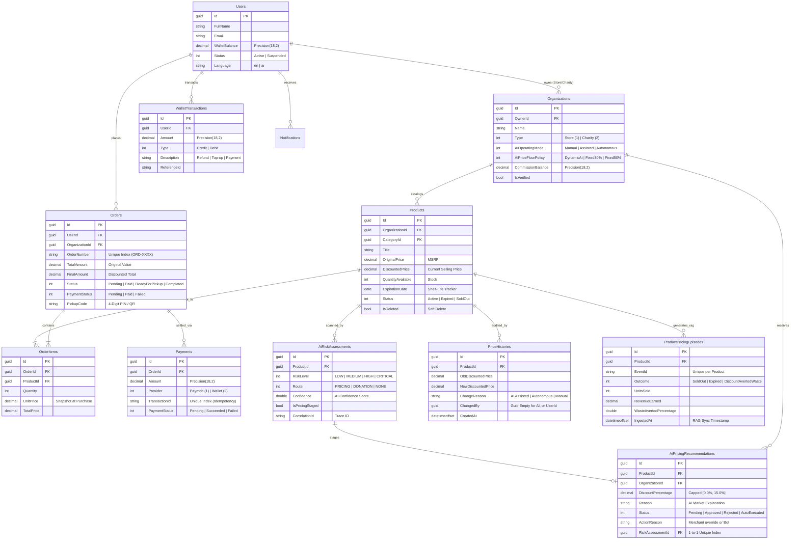
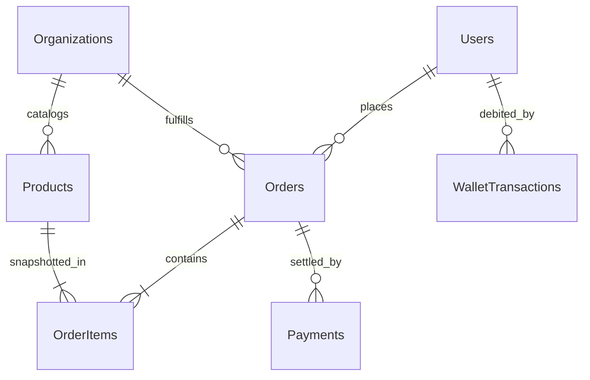
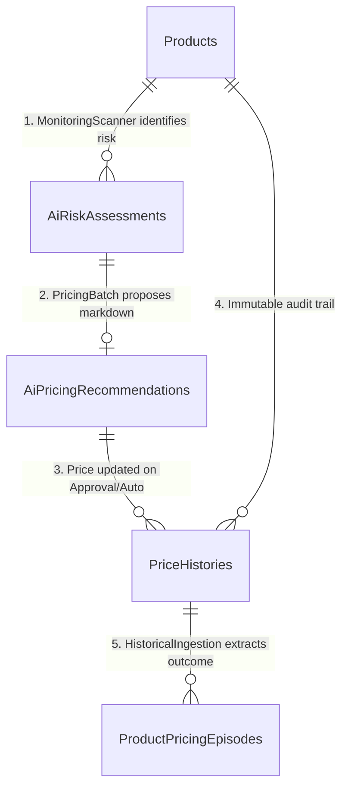
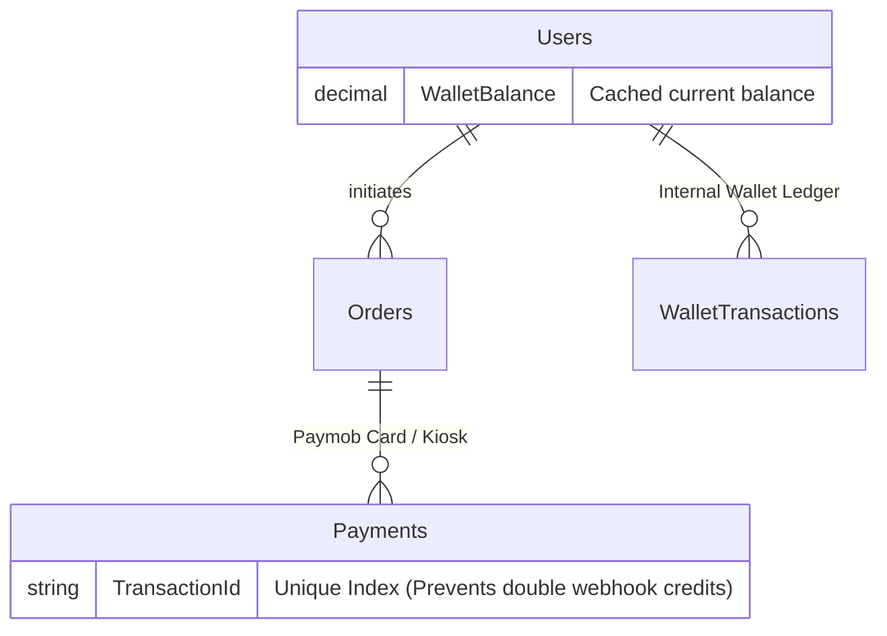

# 🎬 FoodLoop Presentation ERD — Core Showcase Database Architecture

This document serves as the **visual, architectural, and speaking guide** for the **FoodLoop Backend Video Showcase & Presentation**. It highlights the core, mission-critical tables that demonstrate the platform's multi-tenancy, transactional checkout, AI dynamic pricing engine, and financial ledger.

---

## 🌟 1. Core Showcase ERD (The Key 10 Tables)

This high-impact diagram captures the heartbeat of FoodLoop: **Users**, **Stores**, **Products**, **Orders**, **Payments**, and the **AI Pricing & Feedback Subsystem**.

---

## 🎬 2. Scene-by-Scene Visual Sub-Diagrams

### 🛍️ Focus A: The E-Commerce & Checkout Engine (Scenes 3 & 4)

Shows how products move from store shelves to customer carts and active pickup orders.

> [!TIP]
> **Key Architecture to show:**
> 1. **Price Isolation:** `OrderItems` snapshots `UnitPrice` and `TotalPrice` at the exact moment of purchase so future price edits never alter past receipts.
> 2. **Pickup Security:** `Orders.PickupCode` generates a secure PIN / QR payload for merchant verification at the store counter.
> 3. **Soft Deletion:** `Products.IsDeleted` uses EF Core Global Query Filters (`!IsDeleted`) to preserve purchase history even if a merchant deletes a listing.

---

### 🤖 Focus B: The AI Dynamic Pricing & RAG Engine (Scene 8)

Shows how our 3 background workers scan shelf-lives, generate smart markdowns, and feed training data back into the AI.

> [!IMPORTANT]
> **Key Architecture to show:**
> 1. **Dual Operating Modes:**
>    * **Assisted Mode:** Recommendations stay `Pending` until the Store Owner clicks "Approve" (with merchant override authority).
>    * **Autonomous Mode:** Recommendations auto-execute in the background under the **Price Floor Shield** (`DynamicAi`, `Fixed30%`, `Fixed50%`).
> 2. **Deduplication:** When a new pricing cycle runs, older unreviewed recommendations are automatically superseded (`Status = Rejected`), keeping the merchant UI clean.
> 3. **RAG & Feedback Loop:** `ProductPricingEpisodes` tracks real-world outcomes (`UnitsSold`, `RevenueEarned`, `WasteAvertedPercentage`) to train future pricing agents.

---

### 💳 Focus C: Payments, Webhook Idempotency & Wallet Ledger (Scene 5)

Shows financial security, Paymob Accept v4 integration, and in-app wallet balance tracking.

> [!NOTE]
> **Key Architecture to show:**
> 1. **2-Layer Idempotency:** Paymob webhooks validate HMAC SHA-256 signatures and enforce a database **Unique Index** on `Payments.TransactionId`.
> 2. **Atomic Ledger:** Every wallet payment or refund writes an immutable `WalletTransaction` row and updates `Users.WalletBalance` within an EF Core execution transaction.

---

## 🎙️ 3. Table-by-Table Video Script & Screen Talking Points

Use these exact bilingual speaking points when presenting each table on screen:

### 1. 👤 `Users` (`ApplicationUser`)
* **🎯 Columns on Screen:** `Id`, `FullName`, `Email`, `WalletBalance`, `Status`, `Language`.
* **🎙️ English Script:**
  > *"The `Users` table extends ASP.NET Core Identity with custom business domain fields. Notice the `WalletBalance` for instant internal checkout and refunds, and `Language` for bilingual English and Arabic localization across all notifications."*
* **🎙️ Arabic Script:**
  > *"جدول الـ `Users` بيعمل Extension لـ ASP.NET Core Identity مع إضافة حقول الـ Domain الخاصة بينا، زي الـ `WalletBalance` للمحفظة الداخلية وعمليات الـ Refund الفورية، والـ `Language` لدعم تعدد اللغات عربي وإنجليزي."*

---

### 2. 🏪 `Organizations` (Stores & Charities)
* **🎯 Columns on Screen:** `Id`, `OwnerId`, `AiOperatingMode`, `AiPriceFloorPolicy`, `CommissionBalance`, `Type`.
* **🎙️ English Script:**
  > *"The `Organizations` table manages multi-tenancy for both commercial stores and charity partners. Key architectural columns here are `AiOperatingMode`—allowing stores to run in Manual, Assisted, or Autonomous mode—and `AiPriceFloorPolicy`, which defines the safety price floor for AI price adjustments."*
* **🎙️ Arabic Script:**
  > *"جدول الـ `Organizations` هو المسؤول عن الـ Multi-Tenancy للمتاجر والجمعيات الخيرية. أهم الحقول هنا هي `AiOperatingMode` اللي بيحدد وضع الـ AI (يدوي، أو مساعد بموافقة التاجر، أو ذاتي)، والـ `AiPriceFloorPolicy` لحماية أرباح التاجر من تخفيض الأسعار بأقل من الحد المسموح."*

---

### 3. 📦 `Products`
* **🎯 Columns on Screen:** `OriginalPrice`, `DiscountedPrice`, `QuantityAvailable`, `ExpirationDate`, `IsDeleted`.
* **🎙️ English Script:**
  > *"The `Products` table represents inventory items. It tracks `OriginalPrice` vs dynamic `DiscountedPrice`, available stock, and the `ExpirationDate`. It implements soft-deletion via EF Core Global Query Filters (`IsDeleted`), ensuring historical orders are never corrupted if a merchant removes an item."*
* **🎙️ Arabic Script:**
  > *"جدول الـ `Products` بيمثل المخزون. بيسجل السعر الأصلي والسعر المخفض والـ `ExpirationDate` لتتبع تاريخ الصلاحية. الجدول بيطبق الـ Soft Delete عبر EF Core Query Filters علشان نضمن سلامة سجلات المبيعات القديمة لو التاجر مسح المنتج."*

---

### 4. 🛒 `Orders`
* **🎯 Columns on Screen:** `OrderNumber`, `TotalAmount`, `FinalAmount`, `Status`, `PaymentStatus`, `PickupCode`.
* **🎙️ English Script:**
  > *"The `Orders` table manages the purchase lifecycle. It features a unique indexed `OrderNumber` for human tracking, financial totals with exact decimal precision, and a secure `PickupCode` PIN/QR payload used by merchants to verify customers at the store counter."*
* **🎙️ Arabic Script:**
  > *"جدول الـ `Orders` بيدير دورة حياة الطلب من الدفع حتى الاستلام. بيحتوي على `OrderNumber` برقم فريد مميز، وتفاصيل الحساب بدقة `Decimal(18,2)`، و`PickupCode` بيظهر كـ PIN و QR Code التاجر بيعمل له Scan وقت استلام العميل للطلب."*

---

### 5. 🧾 `OrderItems`
* **🎯 Columns on Screen:** `OrderId`, `ProductId`, `UnitPrice`, `Quantity`, `TotalPrice`.
* **🎙️ English Script:**
  > *"The `OrderItems` table snapshots the exact `UnitPrice` and `Quantity` at the moment of checkout. This price isolation ensures that future price mutations or AI markdowns on the catalog never alter past order receipts."*
* **🎙️ Arabic Script:**
  > *"جدول الـ `OrderItems` بيعمل Snapshot لسعر المنتج والكمية لحظة الشراء بالظبط. الـ Isolation ده مهم جداً علشان لو سعر المنتج اتغير أو نزل عليه تخفيض بالـ AI مستقبلاً، الفاتورة القديمة تفضل سليمة وماتتأثرش."*

---

### 6. 💳 `Payments`
* **🎯 Columns on Screen:** `TransactionId`, `Provider`, `Amount`, `PaymentStatus`.
* **🎙️ English Script:**
  > *"The `Payments` table records external gateway settlements, integrating Paymob Accept v4 alongside in-app wallet payments. Notice the Unique Index on `TransactionId`, which provides strict idempotency and prevents double-processing of payment gateway webhooks."*
* **🎙️ Arabic Script:**
  > *"جدول الـ `Payments` بيسجل المعاملات المالية مع بوابة Paymob والمحفظة. العمود المهم جداً هنا هو `TransactionId` وعليه Unique Index عشان يضمن الـ Idempotency ويمنع تكرار معالجة الـ Webhooks لو البوابة بعتت الإشعار مرتين."*

---

### 7. 💰 `WalletTransactions`
* **🎯 Columns on Screen:** `UserId`, `Amount`, `Type`, `Description`, `ReferenceId`.
* **🎙️ English Script:**
  > *"The `WalletTransactions` table is our immutable double-entry ledger. Every wallet top-up, order payment, or refund writes an append-only row and updates the user's cached `WalletBalance` inside an atomic database transaction."*
* **🎙️ Arabic Script:**
  > *"جدول الـ `WalletTransactions` هو دفتر الأستاذ (Ledger) للمحفظة. أي عملية شحن، دفع طلب، أو استرجاع (Refund) بتتسجل كعملية غير قابلة للتعديل وبتحدث رصيد المستخدم داخل Atomic Transaction."*

---

### 8. 🔍 `AiRiskAssessments`
* **🎯 Columns on Screen:** `ProductId`, `RiskLevel`, `Route`, `Confidence`, `CorrelationId`.
* **🎙️ English Script:**
  > *"The `AiRiskAssessments` table is generated by our background `MonitoringScannerHostedService`. It classifies expiring inventory by risk level (Low, Medium, High, Critical) and routes candidates for pricing markdowns or charity donation."*
* **🎙️ Arabic Script:**
  > *"جدول الـ `AiRiskAssessments` بيتم توليده عبر الـ Background Worker `MonitoringScanner`. بيفحص المنتجات القريبة من الانتهاء ويحدد درجة الخطورة ومسار المنتج (تخفيض سعر أو تبرع لجمعية خيرية)."*

---

### 9. 🤖 `AiPricingRecommendations`
* **🎯 Columns on Screen:** `DiscountPercentage`, `Reason`, `Status`, `ActionReason`, `RiskAssessmentId`.
* **🎙️ English Script:**
  > *"The `AiPricingRecommendations` table holds AI-generated markdown proposals from our Python LangGraph microservice. In Assisted Mode, the store owner has manual override authority to approve recommendations; in Autonomous Mode, recommendations execute automatically under the platform's price floor shield. Older unreviewed cycles are automatically superseded to prevent UI duplication."*
* **🎙️ Arabic Script:**
  > *"جدول الـ `AiPricingRecommendations` بيحفظ مقترحات تخفيض الأسعار القادمة من الـ AI Microservice. في وضع الـ Assisted التاجر له كامل الصلاحية لقبول التوصية، وفي وضع الـ Autonomous بتتنفذ تلقائياً تحت حماية الـ Price Floor. كما بيتم عمل Supersede للتوصيات القديمة تلقائياً لمنع التكرار في الواجهة."*

---

### 10. 📈 `PriceHistories`
* **🎯 Columns on Screen:** `OldDiscountedPrice`, `NewDiscountedPrice`, `ChangeReason`, `ChangedBy`.
* **🎙️ English Script:**
  > *"The `PriceHistories` table is an immutable audit log of every price change in the system. Notice that AI automated adjustments stamp `ChangedBy = Guid.Empty`, while merchant manual actions stamp the user's ID alongside the AI correlation trace."*
* **🎙️ Arabic Script:**
  > *"جدول الـ `PriceHistories` هو سجل تدقيق غير قابل للتعديل لكل تغيير في الأسعار. التعديلات الآلية للـ AI بتتسجل بـ `ChangedBy = Guid.Empty`، بينما التعديل اليدوي للتاجر بيسجل الـ UserId ورقم التتبع `CorrelationId`."*

---

### 11. 🧠 `ProductPricingEpisodes` (RAG & Feedback Loop)
* **🎯 Columns on Screen:** `Outcome`, `UnitsSold`, `RevenueEarned`, `WasteAvertedPercentage`, `IngestedAt`.
* **🎙️ English Script:**
  > *"The `ProductPricingEpisodes` table closes the reinforcement learning loop. Our `HistoricalIngestionHostedService` tracks real-world sales outcomes—measuring units sold, revenue recovered, and waste averted percentage—and ingests these episodes into the AI vector store for RAG."*
* **🎙️ Arabic Script:**
  > *"جدول الـ `ProductPricingEpisodes` بيقفل دائرة التعلم للـ AI (Feedback Loop). الـ Background Service بتسجل نتائج المبيعات الفعلية (الوحدات المباعة، الإيرادات، ونسبة إنقاذ الطعام من الهدر) وبترسلها للـ AI RAG للتعلم من التجارب السابقة."*

---

### 12. 🔔 `Notifications`
* **🎯 Columns on Screen:** `UserId`, `Title`, `Body`, `Type`, `IsRead`.
* **🎙️ English Script:**
  > *"The `Notifications` table powers our hybrid communication layer, persisting push alerts sent via SignalR WebSockets for active browser users and Firebase Cloud Messaging (FCM) for mobile devices."*
* **🎙️ Arabic Script:**
  > *"جدول الـ `Notifications` مسؤول عن الإشعارات الفورية، وبيحفظ الإشعارات المرسلة عبر SignalR WebSockets للمتصفح المفتوح و Firebase Cloud Messaging (FCM) للموبايل."*

---

## 📊 4. Summary Table Matrix

| Entity / Table | Core Responsibility | Key Fields to Mention | Presentation Highlights |
| :--- | :--- | :--- | :--- |
| **`Users`** | Identity & Profiles | `WalletBalance`, `Language`, `Status` | Extends ASP.NET Identity with in-app wallet & bilingual localization. |
| **`Organizations`** | Multi-Tenant Businesses | `AiOperatingMode`, `AiPriceFloorPolicy` | Stores AI automation level (Assisted vs Autonomous) and safety floor rules. |
| **`Products`** | Inventory & Expiration | `OriginalPrice`, `DiscountedPrice`, `ExpirationDate` | Tracks real-time shelf life; protected by soft-delete filters. |
| **`Orders`** | Purchase Lifecycle | `OrderNumber`, `FinalAmount`, `PickupCode` | Unique human-readable IDs (`ORD-XXXX`) & QR pickup verification. |
| **`Payments`** | Financial Settlement | `TransactionId`, `Provider`, `PaymentStatus` | Paymob Accept v4 integration with HMAC SHA-256 idempotency. |
| **`WalletTransactions`** | In-App Wallet Ledger | `Amount`, `Type (Credit/Debit)`, `ReferenceId` | Financial audit ledger backing instant in-app checkouts and refunds. |
| **`AiRiskAssessments`** | Shelf-Life Analysis | `RiskLevel`, `Route`, `Confidence` | Automated background classification of expiring food items. |
| **`AiPricingRecommendations`**| Dynamic Markdowns | `DiscountPercentage`, `Status`, `Reason` | AI pricing engine proposals (max 15% markdown per cycle). |
| **`PriceHistories`** | Price Audit Trail | `OldDiscountedPrice`, `NewDiscountedPrice`, `ChangedBy` | Immutable audit log of all pricing mutations (stamped `Guid.Empty` for AI). |
| **`ProductPricingEpisodes`** | AI Reinforcement & RAG | `Outcome`, `UnitsSold`, `WasteAvertedPercentage` | Closed-loop episodic training data for LangGraph agents. |
| **`Notifications`** | Real-Time Push Alerts | `Title`, `Type`, `IsRead` | SignalR WebSockets + Firebase Cloud Messaging (FCM) inbox. |
