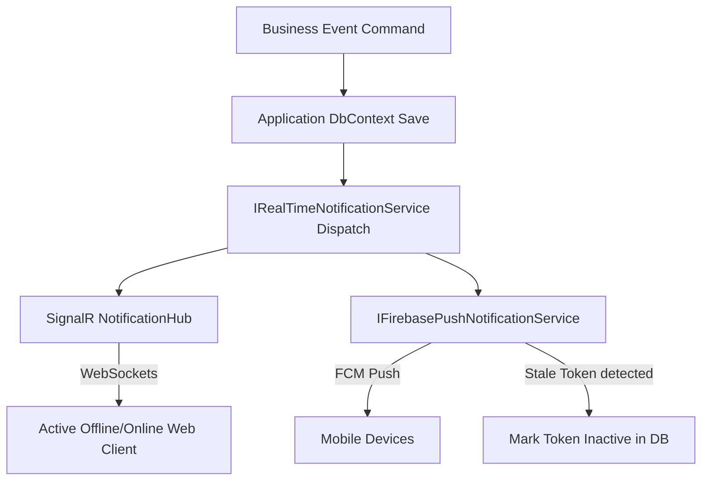

# FoodLoop Notification System Technical Specification

This document provides a comprehensive technical specification for the FoodLoop Notification System. It details the hybrid real-time WebSocket and push delivery architecture, authentication flows, error handling, token lifecycle management, and business event triggers.

---

## 1. Architectural Overview

The FoodLoop Notification System utilizes a hybrid delivery model to ensure low-latency, real-time message propagation alongside reliable mobile push notifications:



1.  **SignalR Real-Time Hub**: Provides persistent WebSocket channels to deliver instantaneous, in-app notifications directly to online clients.
2.  **Firebase Cloud Messaging (FCM)**: Delivers push notifications to Android and iOS mobile devices for background or offline users.

---

## 2. Authentication & Route Security

To prevent unauthorized access and protect user privacy, the notification hub and API endpoints are strictly secured:

### 2.1 Hub Connection Handshake
*   The `NotificationHub` is decorated with the `[Authorize]` attribute.
*   Since standard WebSockets do not support custom authorization headers during the initial handshake, the JWT bearer token is extracted from the connection query string inside [`InfrastructureServiceRegistration.cs`](file:///c:/ITI/server/src/FoodLoop.Infrastructure/DependencyInjection/InfrastructureServiceRegistration.cs):
    ```csharp
    options.Events = new JwtBearerEvents
    {
        OnMessageReceived = context =>
        {
            var accessToken = context.Request.Query["access_token"];
            var path = context.HttpContext.Request.Path;
            if (!string.IsNullOrEmpty(accessToken) && path.StartsWithSegments("/hubs/notifications"))
            {
                context.Token = accessToken;
            }
            return Task.CompletedTask;
        }
    };
    ```

### 2.2 Device Token Registration Endpoint
*   The `NotificationsController` is decorated with the `[Authorize]` attribute.
*   Token registration requires the client to present a valid Bearer Token.

---

## 3. Failure Isolation & Fault Tolerance

The system is designed under the principle of **strict failure isolation** to ensure that non-critical delivery issues do not impact primary business operations.

*   **Transactional Safety**: Database saves occur *before* notifications are triggered. If SignalR or Firebase throws an exception, the parent transaction remains committed and is not rolled back.
*   **Encapsulated Dispatch**: Both SignalR and Firebase calls are wrapped in individual `try-catch` blocks inside [`RealTimeNotificationService.cs`](file:///c:/ITI/server/src/FoodLoop.Infrastructure/Services/RealTimeNotificationService.cs):
    ```csharp
    try
    {
        await _hubContext.Clients.User(userId.ToString()).ReceiveNotification(dto);
    }
    catch (Exception ex)
    {
        _logger.LogError(ex, "SignalR real-time delivery failed for user {UserId}", userId);
    }
    ```

---

## 4. FCM Token Lifecycle & Database Cleanup

Device tokens are monitored continuously. Stale, invalid, or expired tokens are cleaned up dynamically during transmission failures.

### 4.1 Stale Token Detection
When sending messages via FCM, the SDK throws a `FirebaseMessagingException`. The [`FirebasePushNotificationService.cs`](file:///c:/ITI/server/src/FoodLoop.Infrastructure/Services/FirebasePushNotificationService.cs) catches this exception and inspects its error codes:
*   If `MessagingErrorCode` is `Unregistered` or `InvalidArgument` (or `ErrorCode` is `InvalidArgument`), the token is recognized as stale or invalid.
*   The system immediately marks the token record in the database as `IsActive = false`.

### 4.2 Non-Stale Failure Tolerance
If the exception corresponds to a transient error (e.g., `Internal`, `QuotaExceeded`, or `Unavailable`), the token's active status is **not** modified, allowing future retries once the service recovers.

### 4.3 Cleanup Strategy
*   **Flag-Only Deactivation:** Tokens are deactivated (`IsActive = false`) rather than hard-deleted. This preserves audit histories of user devices while ensuring no future network resources are wasted on dead registrations.

---

## 5. Multi-Tenant Isolation & Overlap Prevention

To prevent cross-tenant message leakage (e.g., when a user logs into a device previously used by someone else):
*   Registering a device token via [`UserDeviceTokenService.cs`](file:///c:/ITI/server/src/FoodLoop.Infrastructure/Services/UserDeviceTokenService.cs) automatically scans the database for the same token registered under any *other* user ID.
*   All duplicate tokens belonging to other user IDs are immediately flagged as `IsActive = false`.

---

## 6. Offline User Handling

*   **Real-time channels (SignalR/Firebase):** Handled as "fire-and-forget". If the user is offline or FCM delivery fails, the real-time messages are discarded on those channels.
*   **Database Inbox Fallback:** All dispatched notifications are persistently stored in the `Notifications` database table. Users can query their complete notification inbox history upon logging in or reconnecting.

---

---

## 7. Business Event Triggers & Dispatch Rules

All notification dispatch handlers use **write-time per-recipient localization** via `CultureScope`, resolving resx keys into the recipient's preferred language (`en` / `ar`) at the moment of creation.

| Business Event | Trigger Handler | Target Audience | Notification Type | Key Metadata / Resx Keys |
| :--- | :--- | :--- | :--- | :--- |
| **Order Placed** | `CreateOrderCommandHandler` | Customer | `OrderPlaced` | `NotifOrderPlacedTitle` / `NotifOrderPlacedBody` (`#orderNumber`) |
| **Order Received** | `CreateOrderCommandHandler` | Merchant Owner | `OrderReceived` | `NotifOrderReceivedTitle` / `NotifOrderReceivedBody` (`#orderNumber`, customer name) |
| **Order Status Update** | `UpdateOrderStatusCommandHandler` | Customer | `OrderConfirmed`, `OrderPreparing`, `OrderReadyForPickup`, `OrderCompleted`, `OrderCancelled`, `OrderPending` | Status-specific title/body keys |
| **Product Moderation (Single/OCR)** | `CreateProductCommandHandler` | Admin Role | `ProductUploaded` | `NotifProductModerationTitle` / `NotifProductModerationBodyOcr` (product title, store name) |
| **Product Moderation (CSV Bulk)** | `BulkUploadProductsCommandHandler` | Admin Role | `ProductUploaded` | `NotifProductModerationTitle` / `NotifProductModerationBodyCsv` (product title, store name) |
| **Product Dispute Report** | `ReportProductCommandHandler` | Admin Role | `ProductReported` | `NotifProductReportedTitle` / `NotifProductReportedBody` (product title, reason) |
| **New Support Ticket** | `CreateSupportTicketCommandHandler` | Admin Role | `SupportTicketCreated` | `NotifSupportTicketCreatedTitle` / `NotifSupportTicketCreatedBody` (category, username) |
| **Support Ticket Reply** | `ReplyToSupportTicketCommandHandler` | Ticket Creator | `SupportTicketReply` | `NotifSupportTicketReplyTitle` / `NotifSupportTicketReplyBody` (subject/category) |
| **New User Registration** | `RegisterCommandHandler` / `CreateUserCommandHandler` | Admin Role | `AccountCreated` | `NotifNewUserRegisteredTitle` / `NotifNewUserRegisteredBody` (email, full name) |
| **Admin Direct Note** | `SendAdminNoteCommandHandler` | User | `AdminWarning`, `AdminUrgent`, `AdminNotice` | Custom note title & body (internal notes excluded) |

---

## 8. Client REST API Endpoints

All endpoints are hosted at `/notifications` and require `[Authorize]`:

| HTTP Method & Route | Description | Query Parameters / Body | Response Payload |
| :--- | :--- | :--- | :--- |
| `GET /notifications` | List caller's notification inbox | `pageNumber` (int, default 1)<br>`pageSize` (int, default 20)<br>`isRead` (bool, optional) | `ApiResponse<IReadOnlyList<NotificationDto>>` |
| `GET /notifications/{id:guid}` | Get single notification detail | Route parameter: `id` | `ApiResponse<NotificationDto>` (404 if not found or unauthorized) |
| `GET /notifications/unread-count` | Get total unread count for badge | None | `ApiResponse<int>` |
| `PATCH /notifications/{id:guid}/read` | Mark single notification as read | Route parameter: `id` | `ApiResponse<NotificationDto>` (sets `isRead = true`, `readAt = UtcNow`) |
| `PATCH /notifications/read-all` | Mark all caller's notifications as read | None | `204 NoContent` |
| `POST /notifications/device-token` | Register/update mobile FCM token | `{ "token": "string", "platform": "Android\|iOS" }` | `ApiResponse<{ success: true }>` |

### 8.1 Notification DTO & Deep Linking Schema

```json
{
  "id": "8fa1b2c3-4d5e-6f7a-8b9c-0d1e2f3a4b5c",
  "userId": "11111111-1111-1111-1111-111111111111",
  "title": "Product Requires Moderation",
  "body": "Product 'Fresh Greek Yogurt' listed by 'Spinneys' requires moderation review.",
  "type": "ProductUploaded",
  "isRead": false,
  "readAt": null,
  "entityType": "Product",
  "entityId": "66666666-6666-6666-6666-666666666666",
  "createdAt": "2026-08-19T18:00:00Z"
}
```

* **`entityType` Navigation:**
  * `"Product"` $\rightarrow$ Navigates to `/admin/moderation/products/{entityId}` or `/marketplace/products/{entityId}`
  * `"Order"` $\rightarrow$ Navigates to `/orders/{entityId}` or `/stores/me/orders/{entityId}`
  * `"SupportTicket"` $\rightarrow$ Navigates to `/support-tickets/{entityId}`
  * `"ProductReport"` $\rightarrow$ Navigates to `/admin/disputes/{entityId}`
  * `"User"` $\rightarrow$ Navigates to `/admin/users/{entityId}`

