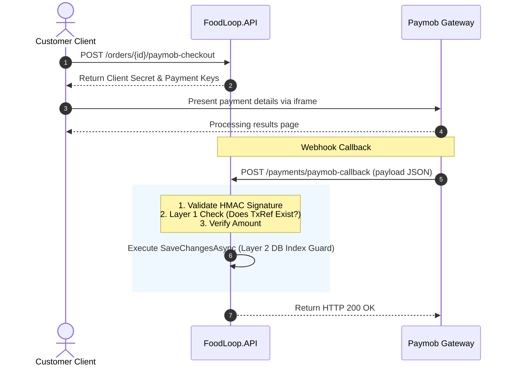

# Payment & Wallet Subsystem Technical Specification

This document provides the complete technical specification and developer integration blueprint for the FoodLoop platform's payment gateway, in-app wallet, refund management, and commission withdrawal subsystems.

---

## 1. Paymob Accept v4 Integration Architecture

FoodLoop integrates with Paymob Accept v4 for online card processing. All webhook callbacks execute signature validation and follow strict idempotency invariants.

### Checkout Initialization
When a user selects online payment at checkout, the client calls:
`POST /orders/{id}/paymob-checkout`

*   **Role/Authentication:** Logged In (Customer)
*   **Request Route Parameter:** `id` (Order Guid)
*   **Response DTO:** `PaymobCheckoutDto`

```json
{
  "clientSecret": "pft_sec_xyz123abc456...",
  "publicKey": "pk_test_abc123xyz...",
  "integrationId": "123456",
  "iframeId": "789012"
}
```

---

### HMAC Verification Algorithm

Paymob requests are verified against timing attacks and body spoofing by validating the `hmac` query parameter.

#### Ordered Concatenation Fields (17 Fields)
The following fields from the Paymob transaction callback body must be concatenated in this exact order, separated by no characters:

1.  `amount_cents`
2.  `created_at`
3.  `currency`
4.  `error_occured`
5.  `has_parent_transaction`
6.  `id`
7.  `integration_id`
8.  `is_3d_secure`
9.  `is_auth`
10. `is_capture`
11. `is_refunded`
12. `is_standalone_payment`
13. `is_voided`
14. `order.id` (Extracted from the `order` nested object)
15. `owner`
16. `pending`
17. `source_data.pan` (Extracted from `source_data` nested object)
18. `source_data.sub_type` (Extracted from `source_data` nested object)
19. `source_data.type` (Extracted from `source_data` nested object)

*Note: The official Paymob specification concatenates these values exactly to construct the HMAC hash.*

#### Secure C# Validation Code
```csharp
using System;
using System.Security.Cryptography;
using System.Text;

public class PaymobSignatureVerifier
{
    public static bool VerifySignature(string concatenatedString, string hmacSecret, string signatureReceived)
    {
        var keyBytes = Encoding.UTF8.GetBytes(hmacSecret);
        var messageBytes = Encoding.UTF8.GetBytes(concatenatedString);

        using (var hmac = new HMACSHA256(keyBytes))
        {
            var computedHash = hmac.ComputeHash(messageBytes);
            var computedSignature = Convert.ToHexString(computedHash).ToLowerInvariant();

            return CryptographicOperations.FixedTimeEquals(
                Encoding.UTF8.GetBytes(computedSignature),
                Encoding.UTF8.GetBytes(signatureReceived)
            );
        }
    }
}
```

---

### Webhook Callback Processing (`POST /payments/paymob-callback`)

*   **URL:** `POST /payments/paymob-callback`
*   **Role/Authentication:** Public (Gated only by HMAC verification)

#### Two-Layer Idempotency Architecture
To protect against network duplication and concurrent retries by Paymob servers, the endpoint implements two-layer idempotency:
1.  **Layer 1 (Pre-Query Check):** Checks if a payment record with the incoming transaction `id` already exists in the database. If found, it short-circuits and returns `Ok`.
2.  **Layer 2 (Database Constraint):** A unique index is configured on the `Payments` table's `TransactionReference` column (ignoring null and empty strings):
    `CREATE UNIQUE INDEX IX_Payments_TransactionReference ON Payments(TransactionReference) WHERE TransactionReference IS NOT NULL AND TransactionReference <> '';`
    If concurrent duplicate requests bypass the Layer 1 check, the database constraint will throw a `DbUpdateException` (unique index violation). The controller catches this exception and returns `Ok` to gracefully short-circuit.

#### Amount Verification
The webhook handler verifies that the `amount_cents` divided by 100 exactly matches `Order.TotalAmount` before marking it paid. If a discrepancy is detected, the transaction is rejected, logged as a warning, and returns a `400 Bad Request`.

#### Success/Failure Mapping
*   If `success == true`, the order status transitions to `Confirmed` and payment status transitions to `Paid`.
*   If `success == false`, the payment status transitions to `Failed` and the order status is left/updated to reflect the payment failure (typically remaining pending or marked cancelled if configured).

#### Polymorphic JSON Field Handling
Paymob webhook payloads can represent numeric fields (like transaction `id` or `integration_id`) as either strings or integers. The parser uses a kind-aware check to extract these safely without raising formatting exceptions:
```csharp
var idProperty = obj.GetProperty("id");
var id = idProperty.ValueKind == JsonValueKind.Number 
    ? idProperty.GetInt64().ToString() 
    : idProperty.GetString() ?? idProperty.GetRawText();
```

---

## 2. In-App Wallet Payment Subsystem

The in-app wallet allows customers to pay using their accrued wallet balance (e.g. from previous refunds).

### Synchronous Wallet Checkout (`POST /orders/{id}/wallet-checkout`)

*   **Role/Authentication:** Logged In (Customer)
*   **Route Parameter:** `id` (Order Guid)
*   **Precondition Guard:** The customer's wallet balance must be greater than or equal to the order total amount. If insufficient, throws `ArgumentException` ("Insufficient wallet balance.").
*   **Transaction Sequence:**
    1.  Acquire user entity with lock or run atomic subtraction:
        `UPDATE Users SET WalletBalance = WalletBalance - @Amount WHERE Id = @UserId AND WalletBalance >= @Amount`
    2.  If `affected == 0`, throw an exception.
    3.  Insert a `WalletTransaction` record:
        *   `UserId` = Customer Id
        *   `Amount` = -Order.TotalAmount
        *   `Type` = `"Payment"`
    4.  Create/Update the `Payment` record with `Method = "Wallet"`, `Status = PaymentStatus.Paid`, and `TransactionReference = Order.Id`.
    5.  Set `Order.PaymentStatus = PaymentStatus.Paid` and `Order.OrderStatus = OrderStatus.Confirmed`.

### Double-Spending Prevention
*   In SQL Server, atomic balance deduction is executed via a single `UPDATE` query utilizing query filters checking the precondition in the `WHERE` clause (`WalletBalance >= @Amount`).
*   In SQLite (unit tests), transactions are executed sequentially using connection-level serialization and command locking to ensure that parallel checkout requests fail gracefully.

---

## 3. Refunds & Platform Commission Lifecycle

### Merchant Order Refund (`POST /stores/me/orders/{id}/refund`)

*   **Role/Authentication:** Logged In (Merchant Owner)
*   **Tenant Ownership Validation:** The merchant must own the organization (`Store`) associated with the order. If the merchant attempts to refund an order from another store, the system throws a `ForbiddenAccessException` (HTTP 403).
*   **Duplicate Refund Guard:** The order status is checked. If it is already `Refunded`, the system throws a `ConflictException` (HTTP 409 Conflict) preventing double refunds.
*   **Atomic Refund Actions:**
    1.  Deduct/Reverse payment status: `Order.PaymentStatus = PaymentStatus.Refunded` and `Order.OrderStatus = OrderStatus.Cancelled`.
    2.  Credit the customer's wallet:
        `UPDATE Users SET WalletBalance = WalletBalance + @Amount WHERE Id = @CustomerId`
    3.  Insert a `WalletTransaction` record:
        *   `UserId` = Customer Id
        *   `Amount` = +Order.TotalAmount
        *   `Type` = `"Refund"`
    4.  Update the merchant's store balances if applicable.

### Admin Commission Withdrawal (`POST /admin/stores/{id}/withdraw-commission`)

*   **Role/Authentication:** Logged In (Admin)
*   **Underflow Guard:** Outstanding commission balance is calculated as:
    `OutstandingCommission = (TotalCompletedOrdersAmount * PlatformCommissionPercent / 100) - CommissionWithdrawn`
    Admin cannot withdraw more than the outstanding commission. If the request amount exceeds `OutstandingCommission`, it throws an `ArgumentException` with an underflow warning.
*   **Deduction Execution:**
    `Organization.CommissionWithdrawn = Organization.CommissionWithdrawn + Amount`

---

## 4. Order & Payment State Machine Transitions

The lifecycle of an order and its associated payment transitions as follows:

| Initial PaymentStatus | Initial OrderStatus | Event / Action | Final PaymentStatus | Final OrderStatus | Description |
| :--- | :--- | :--- | :--- | :--- | :--- |
| `Pending` | `Pending` | Paymob callback `success=true` | `Paid` | `Confirmed` | Online payment completed successfully. |
| `Pending` | `Pending` | Paymob callback `success=false` | `Failed` | `Pending` | Payment failed; order waits for retry or timeout. |
| `Pending` | `Pending` | Wallet checkout executed | `Paid` | `Confirmed` | Customer checks out with wallet balance. |
| `Pending` | `Pending` | Cash checkout executed | `Pending` | `Confirmed` | Customer selects Cash on Pickup/Delivery. Order is confirmed for store preparation. |
| `Pending` (Cash) | `ReadyForPickup`/`Confirmed` | Store marks order complete | `Paid` | `Completed` | Customer pays cash upon pickup; order marked Paid. |
| `Paid` | `Confirmed` | Store marks order ready | `Paid` | `ReadyForPickup` | Order prepared by store. |
| `Paid` | `ReadyForPickup` | Store marks order complete | `Paid` | `Completed` | Customer picks up the order. |
| `Paid` | `Confirmed`/`Ready` | Store owner triggers refund | `Refunded` | `Cancelled` | Merchant cancels and refunds order to customer wallet. |

---

## 5. Visual Sequence Diagrams

### Diagram 1: Paymob Checkout & Webhook Callback Lifecycle


### Diagram 2: Wallet Checkout Flow
```mermaid
sequenceDiagram
    autonumber
    actor Customer
    participant API as FoodLoop.API
    database DB as Database
    
    Customer->>API: POST /orders/{id}/wallet-checkout
    API->>DB: Load Customer WalletBalance & Order TotalAmount
    DB-->>API: Return Balance
    alt Balance < TotalAmount
        API-->>Customer: Throw 400 Insufficient Balance
    else Balance >= TotalAmount
        rect rgb(240, 248, 255)
            Note over API, DB: Transaction Scope
            API->>DB: Deduct WalletBalance from User (atomic)
            API->>DB: Insert WalletTransaction (Type: "Payment")
            API->>DB: Update Payment Status & Order Status
            API->>DB: Commit Transaction
        end
        API-->>Customer: Return HTTP 200 (ApiResponse<OrderDto>)
    end
```

### Diagram 3: Merchant Refund & Customer Wallet Credit Flow
```mermaid
sequenceDiagram
    autonumber
    actor Merchant
    participant API as FoodLoop.API
    database DB as Database
    
    Merchant->>API: POST /stores/me/orders/{id}/refund
    API->>DB: Load Order, Organization, Owner
    DB-->>API: Return entities
    
    alt Merchant is not Store Owner
        API-->>Merchant: Return HTTP 403 Forbidden
    else Order already refunded
        API-->>Merchant: Return HTTP 409 Conflict
    else Valid Refund
        rect rgb(240, 255, 240)
            Note over API, DB: Transaction Scope
            API->>DB: Set OrderStatus = Cancelled, PaymentStatus = Refunded
            API->>DB: Add refund amount to Customer WalletBalance
            API->>DB: Insert WalletTransaction (Type: "Refund")
            API->>DB: Commit Transaction
        end
        API-->>Merchant: Return HTTP 200 (ApiResponse<OrderDto>)
    end
```

---

## 6. JSON Contract Catalog

### 1. Paymob Checkout Initialize
*   `POST /orders/{id}/paymob-checkout`

**Request:** None (Empty Body)

**Response (HTTP 200):**
```json
{
  "success": true,
  "message": "Checkout session generated.",
  "data": {
    "clientSecret": "pft_sec_9876543210fedcba...",
    "publicKey": "pk_test_mnbvcxzlkjhgfdsa...",
    "integrationId": "123456",
    "iframeId": "789012"
  }
}
```

### 2. Wallet Checkout
*   `POST /orders/{id}/wallet-checkout`

**Request:** None (Empty Body)

**Response (HTTP 200):**
```json
{
  "success": true,
  "message": "Wallet payment processed successfully.",
  "data": {
    "id": "a1b2c3d4-e5f6-7a8b-9c0d-1e2f3a4b5c6d",
    "userId": "9f8e7d6c-5b4a-3f2e-1d0c-9b8a7f6e5d4c",
    "totalAmount": 150.00,
    "orderStatus": "Confirmed",
    "paymentStatus": "Paid",
    "createdAt": "2026-08-18T20:11:00Z"
  }
}
```

### 3. Merchant Refund Order
*   `POST /stores/me/orders/{id}/refund`

**Request:** None (Empty Body)

**Response (HTTP 200):**
```json
{
  "success": true,
  "message": "Order was successfully cancelled and refunded to customer wallet.",
  "data": {
    "id": "a1b2c3d4-e5f6-7a8b-9c0d-1e2f3a4b5c6d",
    "userId": "9f8e7d6c-5b4a-3f2e-1d0c-9b8a7f6e5d4c",
    "totalAmount": 150.00,
    "orderStatus": "Cancelled",
    "paymentStatus": "Refunded",
    "createdAt": "2026-08-18T20:11:00Z"
  }
}
```

### 4. Admin Withdraw Commission
*   `POST /admin/stores/{id}/withdraw-commission`

**Request:**
```json
{
  "amount": 250.00
}
```

**Response (HTTP 200):**
```json
{
  "success": true,
  "message": "Commission withdrawal recorded.",
  "data": {
    "organizationId": "5f6e7d8c-9b0a-1a2b-3c4d-5e6f7a8b9c0d",
    "withdrawnAmount": 250.00,
    "remainingOutstandingCommission": 75.00
  }
}
```
