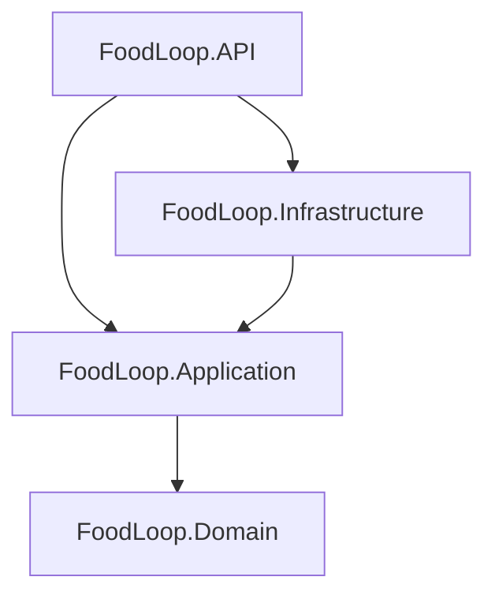
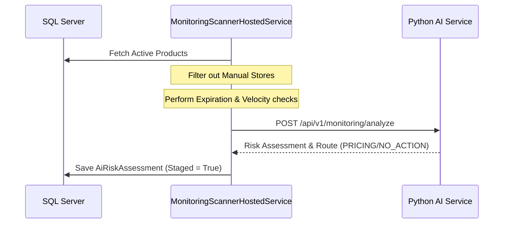
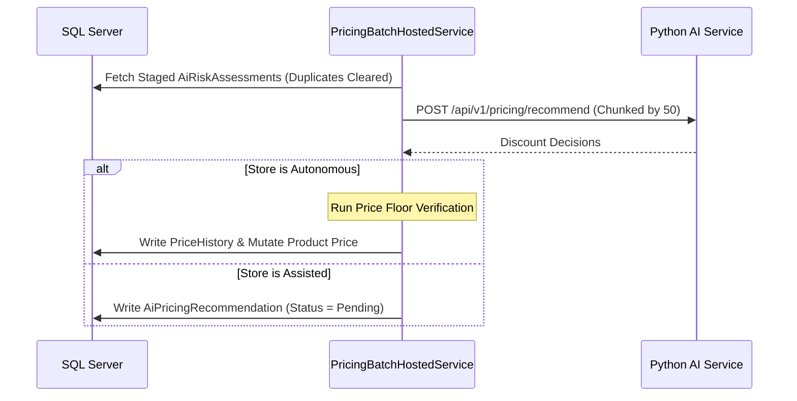

# System Context Specification: FoodLoop Backend Platform

This document serves as the single source of truth and technical specification for the entire FoodLoop backend solution. It describes the Onion architecture, database schema, API endpoints, AI service integrations, resilience subsystems, background workers, and business logic invariants.

---

## 1. System Architecture & Tech Stack

### Architecture Pattern
FoodLoop follows **Clean Architecture (Onion)** with a strict separation of concerns, utilizing **CQRS (Command Query Responsibility Segregation)** facilitated by **MediatR**.



### Core Runtime & Frameworks
*   **Runtime:** .NET 10 (C# 13)
*   **Database Access:** Entity Framework Core 10 (SQL Server provider)
*   **Identity & Security:** ASP.NET Core Identity (Role-based authorization)
*   **Real-time Communication:** SignalR (for instant system and order notifications)

### External Services & Integrations
*   **AI Microservice:** Python FastAPI service executing LangGraph business agent pipelines.
*   **Payment Gateway:** Paymob Accept v4 Integration (webhook callbacks and iframe checkout redirection).
*   **OCR Engine:** Google Gemini AI OCR (Stateless OCR scans for near-expiry products).
*   **Email Dispatcher:** Brevo Email API (via SMTP or REST).
*   **Cloud Storage:** Cloudinary (for merchant documents, logos, and product photos).

### Directory & Project Layout

```
c:\ITI\server\
├── src/
│   ├── FoodLoop.Domain/            # Enterprise Entities, Value Objects, Domain Enums, and Core Rules.
│   ├── FoodLoop.Application/       # DTOs, Mapping interfaces, MediatR Commands/Queries, Exceptions, and Request Validators.
│   ├── FoodLoop.Infrastructure/    # DBContext, Repository implementation, Identity services, Hosted Background workers, external HTTP clients (AI service), and SignalR hubs.
│   └── FoodLoop.API/               # Web Controllers, Global Exceptions middleware, appsettings, and Startup Configuration.
├── test/
│   ├── FoodLoop.Domain.Tests/      # Unit tests for Domain aggregates and entities.
│   ├── FoodLoop.Application.Tests/ # Unit tests for MediatR queries, commands, and validator configurations.
│   └── FoodLoop.Infrastructure.Tests/ # Unit & Integration tests using InMemory DB / Mock managers.
└── SYSTEM_CONTEXT.md               # This drop-in system specification file.
```

---

## 2. Complete Database Schema & Persistence

### Audit Conventions
All tables except join tables inherit from `BaseEntity` (providing a `Guid Id` primary key, `DateTimeOffset CreatedAt`, `Guid? CreatedBy`, `DateTimeOffset? UpdatedAt`, and `Guid? UpdatedBy`). Tables implementing soft deletion inherit `ISoftDelete` (stamping `bool IsDeleted`, `DateTimeOffset? DeletedAt`, and `Guid? DeletedBy`).

### EF Core Interceptors & Query Filters
*   **Timestamping & Soft Deletion Interception:** Overridden `SaveChangesAsync` inside `ApplicationDbContext` intercepts modified/deleted entities to stamp metadata and convert physical deletes into soft updates:
    ```csharp
    var now = DateTimeOffset.UtcNow;
    foreach (var entry in ChangeTracker.Entries<BaseEntity>()) {
        if (entry.State == EntityState.Added) entry.Entity.CreatedAt = now;
        else if (entry.State == EntityState.Modified) entry.Entity.UpdatedAt = now;
    }
    foreach (var entry in ChangeTracker.Entries<ISoftDelete>()) {
        if (entry.State == EntityState.Deleted) {
            entry.State = EntityState.Modified;
            entry.Entity.IsDeleted = true;
            entry.Entity.DeletedAt = now;
        }
    }
    ```
*   **Global Soft Delete Filter:** Automatically applied to `Products` and `Organizations`:
    `builder.HasQueryFilter(x => !x.IsDeleted);`

---

### Database Schema Table Catalog

#### `Users` Table (ASP.NET Core Identity custom table)
*   **PK:** `Id` (`uniqueidentifier`, NOT NULL)
*   **Columns:**
    *   `FullName` (`nvarchar(max)`, NOT NULL)
    *   `Language` (`nvarchar(max)`, NOT NULL, Default: `'en'`)
    *   `ProfileImage` (`nvarchar(max)`, NULL)
    *   `Status` (`int`, NOT NULL, Maps to `UserStatus` Enum)
    *   `WalletBalance` (`decimal(18,2)`, NOT NULL, Default: `0.00`)
    *   `OrderUpdatesEnabled` (`bit`, NOT NULL, Default: `1`)
    *   `MarketingNotificationsEnabled` (`bit`, NOT NULL, Default: `0`)
    *   `CreatedAt` (`datetimeoffset`, NOT NULL)
    *   `UpdatedAt` (`datetimeoffset`, NULL)
    *   `Email`, `NormalizedEmail`, `PasswordHash`, `SecurityStamp`, `ConcurrencyStamp`, `PhoneNumber` (Inherited from Identity)
*   **Indexes:** Index on `NormalizedEmail`.

#### `Organizations` Table (Stores)
*   **PK:** `Id` (`uniqueidentifier`, NOT NULL)
*   **FKs:** `OwnerId` -> `Users.Id`
*   **Columns:**
    *   `OwnerId` (`uniqueidentifier`, NOT NULL)
    *   `Name` (`nvarchar(150)`, NOT NULL)
    *   `Description` (`nvarchar(max)`, NULL)
    *   `Logo` (`nvarchar(max)`, NULL)
    *   `CoverPhoto` (`nvarchar(max)`, NULL)
    *   `Phone` (`nvarchar(max)`, NULL)
    *   `Email` (`nvarchar(max)`, NULL)
    *   `BusinessCategory` (`int`, NULL)
    *   `Governorate` (`nvarchar(100)`, NULL)
    *   `City` (`nvarchar(100)`, NULL)
    *   `Neighborhood` (`nvarchar(100)`, NULL)
    *   `Street` (`nvarchar(200)`, NULL)
    *   `BuildingNo` (`nvarchar(max)`, NULL)
    *   `Latitude` (`float`, NULL)
    *   `Longitude` (`float`, NULL)
    *   `OpeningHours` (`nvarchar(max)`, NULL, JSON-encoded schedule)
    *   `VerificationStatus` (`int`, NOT NULL, Maps to `VerificationStatus` Enum)
    *   `AdminNote` (`nvarchar(max)`, NULL)
    *   `AverageRating` (`float`, NOT NULL)
    *   `AiOperatingMode` (`nvarchar(max)`, NOT NULL, Default: `'Manual'`)
    *   `AiAutoDiscountEnabled` (`bit`, NOT NULL, Default: `0`)
    *   `AiAutoDiscountPercent` (`int`, NOT NULL, Default: `20`)
    *   `AiAutoDiscountDaysBeforeExpiry` (`int`, NOT NULL, Default: `3`)
    *   `AiAutoPricingEnabled` (`bit`, NOT NULL, Default: `0`)
    *   `CommissionWithdrawn` (`decimal(18,2)`, NOT NULL, Default: `0.00`)
    *   `IsDeleted` (`bit`, NOT NULL, Default: `0`)
    *   `DeletedAt` (`datetimeoffset`, NULL)
*   **Indexes:** Indexes on `OwnerId`, `VerificationStatus`.

#### `Products` Table
*   **PK:** `Id` (`uniqueidentifier`, NOT NULL)
*   **FKs:**
    *   `OrganizationId` -> `Organizations.Id` (Cascade: `Restrict`)
    *   `CategoryId` -> `Categories.Id` (Cascade: `Restrict`)
*   **Columns:**
    *   `OrganizationId` (`uniqueidentifier`, NOT NULL)
    *   `CategoryId` (`uniqueidentifier`, NOT NULL)
    *   `Title` (`nvarchar(150)`, NOT NULL)
    *   `Description` (`nvarchar(max)`, NULL)
    *   `OriginalPrice` (`decimal(18,2)`, NOT NULL)
    *   `DiscountedPrice` (`decimal(18,2)`, NOT NULL)
    *   `QuantityAvailable` (`int`, NOT NULL)
    *   `ExpirationDate` (`date`, NOT NULL)
    *   `Status` (`int`, NOT NULL, Maps to `ProductStatus` Enum)
    *   `ModerationNote` (`nvarchar(max)`, NULL)
    *   `ExpiryVerificationState` (`int`, NOT NULL, Default: `0`, Maps to `ExpiryVerificationState`)
    *   `IsDeleted` (`bit`, NOT NULL, Default: `0`)
    *   `DeletedAt` (`datetimeoffset`, NULL)

#### `ProductImages` Table
*   **PK:** `Id` (`uniqueidentifier`, NOT NULL)
*   **FKs:** `ProductId` -> `Products.Id` (Cascade: `Cascade`)
*   **Columns:**
    *   `ProductId` (`uniqueidentifier`, NOT NULL)
    *   `ImageUrl` (`nvarchar(max)`, NOT NULL)
    *   `DisplayOrder` (`int`, NOT NULL)

#### `Categories` Table
*   **PK:** `Id` (`uniqueidentifier`, NOT NULL)
*   **Columns:**
    *   `Name` (`nvarchar(100)`, NOT NULL)
    *   `Description` (`nvarchar(max)`, NULL)
    *   `Icon` (`nvarchar(max)`, NULL)

#### `Orders` Table
*   **PK:** `Id` (`uniqueidentifier`, NOT NULL)
*   **FKs:** `UserId` -> `Users.Id`
*   **Columns:**
    *   `UserId` (`uniqueidentifier`, NOT NULL)
    *   `TotalAmount` (`decimal(18,2)`, NOT NULL)
    *   `PaymentStatus` (`int`, NOT NULL, Maps to `PaymentStatus` Enum)
    *   `OrderStatus` (`int`, NOT NULL, Maps to `OrderStatus` Enum)

#### `OrderItems` Table
*   **Composite PK:** (`OrderId`, `ProductId`)
*   **FKs:**
    *   `OrderId` -> `Orders.Id` (Cascade: `Cascade`)
    *   `ProductId` -> `Products.Id` (Cascade: `Restrict`)
*   **Columns:**
    *   `Quantity` (`int`, NOT NULL)
    *   `UnitPrice` (`decimal(18,2)`, NOT NULL)

#### `Payments` Table
*   **PK:** `Id` (`uniqueidentifier`, NOT NULL)
*   **FKs:** `OrderId` -> `Orders.Id` (Cascade: `Cascade`)
*   **Columns:**
    *   `OrderId` (`uniqueidentifier`, NOT NULL)
    *   `Amount` (`decimal(18,2)`, NOT NULL)
    *   `Method` (`nvarchar(max)`, NOT NULL) -- "CreditCard", "Wallet", "Paymob"
    *   `Status` (`int`, NOT NULL, Maps to `PaymentStatus` Enum)
    *   `TransactionReference` (`nvarchar(200)`, NULL) -- Unique filtered index (WHERE [TransactionReference] IS NOT NULL AND [TransactionReference] <> '')

#### `PriceHistories` Table
*   **PK:** `Id` (`uniqueidentifier`, NOT NULL)
*   **FKs:** `ProductId` -> `Products.Id` (Cascade: `Cascade`)
*   **Columns:**
    *   `ProductId` (`uniqueidentifier`, NOT NULL)
    *   `OldOriginalPrice` (`decimal(18,2)`, NOT NULL)
    *   `OldDiscountedPrice` (`decimal(18,2)`, NOT NULL)
    *   `NewOriginalPrice` (`decimal(18,2)`, NOT NULL)
    *   `NewDiscountedPrice` (`decimal(18,2)`, NOT NULL)
    *   `ChangeReason` (`nvarchar(max)`, NOT NULL)
    *   `ChangedBy` (`uniqueidentifier`, NOT NULL)

#### `Donations` Table
*   **PK:** `Id` (`uniqueidentifier`, NOT NULL)
*   **FKs:**
    *   `DonorOrganizationId` -> `Organizations.Id` (Cascade: `Restrict`)
    *   `RecipientOrganizationId` -> `Organizations.Id` (Cascade: `Restrict`)
    *   `ProductId` -> `Products.Id` (Cascade: `Restrict`)
*   **Columns:**
    *   `DonorOrganizationId` (`uniqueidentifier`, NOT NULL)
    *   `RecipientOrganizationId` (`uniqueidentifier`, NOT NULL)
    *   `ProductId` (`uniqueidentifier`, NOT NULL)
    *   `Quantity` (`int`, NOT NULL)
    *   `DonatedAt` (`datetimeoffset`, NOT NULL)
    *   `Note` (`nvarchar(max)`, NULL)

#### `WalletTransactions` Table
*   **PK:** `Id` (`uniqueidentifier`, NOT NULL)
*   **Columns:**
    *   `UserId` (`uniqueidentifier`, NOT NULL)
    *   `Amount` (`decimal(18,2)`, NOT NULL)
    *   `Type` (`nvarchar(max)`, NOT NULL) -- "Refund", "Payment", "Deposit"
    *   `ReferenceId` (`nvarchar(max)`, NULL)
    *   `Description` (`nvarchar(max)`, NULL)
*   **Indexes:** Index on `UserId`.

#### `Addresses` Table
*   **PK:** `Id` (`uniqueidentifier`, NOT NULL)
*   **FKs:** `UserId` -> `Users.Id` (Cascade: `Cascade`)
*   **Columns:**
    *   `UserId` (`uniqueidentifier`, NOT NULL)
    *   `Governorate` (`nvarchar(100)`, NOT NULL)
    *   `City` (`nvarchar(100)`, NOT NULL)
    *   `Neighborhood` (`nvarchar(100)`, NOT NULL)
    *   `Street` (`nvarchar(200)`, NOT NULL)
    *   `BuildingNo` (`nvarchar(max)`, NOT NULL)
    *   `FloorNo` (`nvarchar(max)`, NULL)
    *   `ApartmentNo` (`nvarchar(max)`, NULL)
    *   `AddressType` (`int`, NOT NULL, Maps to `AddressType` Enum)
    *   `IsDefault` (`bit`, NOT NULL)

#### `ProductReports` Table
*   **PK:** `Id` (`uniqueidentifier`, NOT NULL)
*   **FKs:**
    *   `ProductId` -> `Products.Id` (Cascade: `Cascade`)
    *   `ReporterUserId` -> `Users.Id`
*   **Columns:**
    *   `ProductId` (`uniqueidentifier`, NOT NULL)
    *   `ReporterUserId` (`uniqueidentifier`, NOT NULL)
    *   `Reason` (`nvarchar(max)`, NOT NULL)
    *   `Comment` (`nvarchar(max)`, NULL)
    *   `Status` (`nvarchar(max)`, NOT NULL, Default: `'Pending'`) -- "Pending", "Resolved", "Dismissed"
    *   `AdminNote` (`nvarchar(max)`, NULL)
    *   `ImageUrl` (`nvarchar(500)`, NULL)

#### `Reviews` Table
*   **PK:** `Id` (`uniqueidentifier`, NOT NULL)
*   **FKs:**
    *   `OrganizationId` -> `Organizations.Id` (Cascade: `Restrict`)
    *   `OrderId` -> `Orders.Id` (Cascade: `Restrict`)
    *   `ReviewerId` -> `Users.Id`
*   **Columns:**
    *   `OrganizationId` (`uniqueidentifier`, NOT NULL)
    *   `OrderId` (`uniqueidentifier`, NOT NULL)
    *   `ReviewerId` (`uniqueidentifier`, NOT NULL)
    *   `Rating` (`int`, NOT NULL) -- [1, 5]
    *   `Comment` (`nvarchar(max)`, NULL)

#### `RefreshTokens` Table
*   **PK:** `Id` (`uniqueidentifier`, NOT NULL)
*   **FKs:** `UserId` -> `Users.Id` (Cascade: `Cascade`)
*   **Columns:**
    *   `UserId` (`uniqueidentifier`, NOT NULL)
    *   `Token` (`nvarchar(max)`, NOT NULL)
    *   `ExpiresAt` (`datetimeoffset`, NOT NULL)
    *   `IsRevoked` (`bit`, NOT NULL)

#### `AiRiskAssessments` Table
*   **PK:** `Id` (`uniqueidentifier`, NOT NULL)
*   **FKs:** `ProductId` -> `Products.Id` (Cascade: `Cascade`)
*   **Columns:**
    *   `ProductId` (`uniqueidentifier`, NOT NULL)
    *   `RiskLevel` (`int`, NOT NULL, Maps to `AiRiskLevel` Enum)
    *   `Route` (`int`, NOT NULL, Maps to `AiRoute` Enum)
    *   `Reason` (`nvarchar(max)`, NOT NULL)
    *   `Confidence` (`float`, NOT NULL)
    *   `RequestedContext` (`nvarchar(max)`, NULL, JSON block of external parameters)
    *   `IsPricingStaged` (`bit`, NOT NULL, Default: `0`)
    *   `CorrelationId` (`nvarchar(64)`, NOT NULL)
    *   `SnapshotOriginalPrice` (`decimal(18,2)`, NULL)
    *   `SnapshotQuantityAvailable` (`int`, NULL)
    *   `SnapshotProductStatus` (`int`, NULL)

#### `AiPricingRecommendations` Table
*   **PK:** `Id` (`uniqueidentifier`, NOT NULL)
*   **FKs:**
    *   `ProductId` -> `Products.Id` (Cascade: `Cascade`)
    *   `OrganizationId` -> `Organizations.Id` (Cascade: `Cascade`)
    *   `RiskAssessmentId` -> `AiRiskAssessments.Id` (Cascade: `SetNull` / `NoAction`)
*   **Columns:**
    *   `ProductId` (`uniqueidentifier`, NOT NULL)
    *   `OrganizationId` (`uniqueidentifier`, NOT NULL)
    *   `DiscountPercentage` (`decimal(5,2)`, NOT NULL)
    *   `Reason` (`nvarchar(max)`, NOT NULL)
    *   `Confidence` (`float`, NOT NULL)
    *   `ActionRequirement` (`int`, NOT NULL, Maps to `AiActionRequirement` Enum)
    *   `ActionReason` (`nvarchar(max)`, NOT NULL)
    *   `Status` (`int`, NOT NULL, Maps to `AiRecommendationStatus` Enum)
    *   `ApprovedBy` (`uniqueidentifier`, NULL)
    *   `ApprovedAt` (`datetimeoffset`, NULL)
    *   `ExecutedAt` (`datetimeoffset`, NULL)
    *   `RiskAssessmentId` (`uniqueidentifier`, NULL)
    *   `CorrelationId` (`nvarchar(64)`, NOT NULL)
    *   `SnapshotOriginalPrice` (`decimal(18,2)`, NULL)
    *   `SnapshotQuantityAvailable` (`int`, NULL)
    *   `SnapshotProductStatus` (`int`, NULL)

#### `AdminNotes` Table
*   **PK:** `Id` (`uniqueidentifier`, NOT NULL)
*   **FKs:** `RecipientUserId` -> `Users.Id`
*   **Columns:**
    *   `RecipientUserId` (`uniqueidentifier`, NOT NULL)
    *   `Category` (`nvarchar(50)`, NOT NULL) -- "Notice", "Warning", "Urgent", "Internal"
    *   `Template` (`nvarchar(max)`, NULL)
    *   `Title` (`nvarchar(200)`, NOT NULL)
    *   `Body` (`nvarchar(4000)`, NOT NULL)
    *   `IsInternal` (`bit`, NOT NULL, Default: `0`)

#### `SupportTickets` Table
*   **PK:** `Id` (`uniqueidentifier`, NOT NULL)
*   **FKs:** `UserId` -> `Users.Id`
*   **Columns:**
    *   `UserId` (`uniqueidentifier`, NOT NULL)
    *   `Title` (`nvarchar(150)`, NOT NULL)
    *   `Description` (`nvarchar(max)`, NOT NULL)
    *   `Status` (`int`, NOT NULL, Maps to `TicketStatus` Enum) -- "Open", "InProgress", "Resolved", "Closed"
    *   `Priority` (`int`, NOT NULL, Maps to `TicketPriority` Enum) -- "Low", "Medium", "High", "Urgent"

#### `TicketMessages` Table
*   **PK:** `Id` (`uniqueidentifier`, NOT NULL)
*   **FKs:**
    *   `TicketId` -> `SupportTickets.Id` (Cascade: `Cascade`)
    *   `SenderId` -> `Users.Id`
*   **Columns:**
    *   `TicketId` (`uniqueidentifier`, NOT NULL)
    *   `SenderId` (`uniqueidentifier`, NOT NULL)
    *   `MessageText` (`nvarchar(max)`, NOT NULL)
    *   `SentAt` (`datetimeoffset`, NOT NULL)

#### `AIRecognitionResults` Table (Gemini OCR tracking)
*   **PK:** `Id` (`uniqueidentifier`, NOT NULL)
*   **FKs:** `ProductId` -> `Products.Id` (Cascade: `Cascade`)
*   **Columns:**
    *   `ProductId` (`uniqueidentifier`, NOT NULL)
    *   `OcrText` (`nvarchar(max)`, NOT NULL)
    *   `ConfidenceScore` (`float`, NOT NULL)
    *   `ExtractedExpirationDate` (`date`, NULL)
    *   `Reviewed` (`bit`, NOT NULL, Default: `0`)

#### `ProductPricingEpisodes` Table
*   **PK:** `Id` (`uniqueidentifier`, NOT NULL)
*   **FKs:** `ProductId` -> `Products.Id` (Cascade: `Cascade`)
*   **Columns:**
    *   `ProductId` (`uniqueidentifier`, NOT NULL)
    *   `EventId` (`nvarchar(450)`, NOT NULL)
    *   `RecordedAt` (`datetimeoffset`, NOT NULL)
    *   `IngestedAt` (`datetimeoffset`, NULL)
    *   `IngestionCorrelationId` (`nvarchar(64)`, NULL)
    *   `Outcome` (`nvarchar(max)`, NOT NULL) -- "SoldOut", "Expired", "PartialSale"
    *   `DiscountPercentage` (`float`, NOT NULL)
    *   `SellThroughRate` (`float`, NOT NULL)

#### `SystemSettings` Table
*   **PK:** `Id` (`uniqueidentifier`, NOT NULL)
*   **Columns:**
    *   `MaxDiscountPerCyclePercent` (`int`, NOT NULL, Default: `10`)
    *   `DefaultPriceFloorPolicy` (`int`, NOT NULL, Maps to `PriceFloorPolicy` Enum)
    *   `NewBusinessDefaultAutomationMode` (`int`, NOT NULL, Maps to `AutomationMode` Enum)
    *   `AutoVerifyPartnerStores` (`bit`, NOT NULL, Default: `0`)
    *   `BulkProductUploadEnabled` (`bit`, NOT NULL, Default: `1`)
    *   `PlatformCommissionPercent` (`int`, NOT NULL, Default: `10`)
    *   `ApiRequestRateLimitPerMinute` (`int`, NOT NULL, Default: `120`)
    *   `MaxExpiredReportsBeforeDeactivation` (`int`, NOT NULL, Default: `3`)

---

## 3. Data Transfer Objects (DTO) Contracts

### Core Domain DTOs

```csharp
public class ProductDto
{
    public Guid Id { get; set; }
    public Guid OrganizationId { get; set; }
    public Guid CategoryId { get; set; }
    public string CategoryName { get; set; } = string.Empty;
    public string Title { get; set; } = string.Empty;
    public string? Description { get; set; }
    public decimal OriginalPrice { get; set; }
    public decimal DiscountedPrice { get; set; }
    public int QuantityAvailable { get; set; }
    public DateOnly ExpirationDate { get; set; }
    public string ExpiryVerificationState { get; set; } = string.Empty;
    public string Status { get; set; } = string.Empty;
    public IReadOnlyList<ProductImageDto> Images { get; set; } = Array.Empty<ProductImageDto>();
}

public class OrderDto
{
    public Guid Id { get; set; }
    public Guid UserId { get; set; }
    public string UserFullName { get; set; } = string.Empty;
    public decimal TotalAmount { get; set; }
    public string PaymentStatus { get; set; } = string.Empty;
    public string OrderStatus { get; set; } = string.Empty;
    public DateTimeOffset CreatedAt { get; set; }
    public DateTimeOffset? UpdatedAt { get; set; }
    public Guid? StoreId { get; set; }
    public IReadOnlyList<OrderItemDto> Items { get; set; } = Array.Empty<OrderItemDto>();
}

public class UserDto
{
    public Guid Id { get; set; }
    public string FullName { get; set; } = string.Empty;
    public string Email { get; set; } = string.Empty;
    public string? PhoneNumber { get; set; }
    public string? ProfileImage { get; set; }
    public string Language { get; set; } = "en";
    public string Status { get; set; } = "Active";
    public bool OrderUpdatesEnabled { get; set; } = true;
    public bool MarketingNotificationsEnabled { get; set; }
    public IReadOnlyList<string> Roles { get; set; } = Array.Empty<string>();
    public DateTimeOffset CreatedAt { get; set; }
}

public class OrganizationDto
{
    public Guid Id { get; set; }
    public string Name { get; set; } = string.Empty;
    public string? Description { get; set; }
    public string? Logo { get; set; }
    public string? CoverPhoto { get; set; }
    public string? Phone { get; set; }
    public string? Email { get; set; }
    public BusinessCategory? BusinessCategory { get; set; }
    public string? Governorate { get; set; }
    public string? City { get; set; }
    public string? Neighborhood { get; set; }
    public string? Street { get; set; }
    public string? BuildingNo { get; set; }
    public double? Latitude { get; set; }
    public double? Longitude { get; set; }
    public string VerificationStatus { get; set; } = string.Empty;
    public string? AdminNote { get; set; }
    public string? OpeningHours { get; set; }
    public IReadOnlyList<OrganizationDocumentDto> Documents { get; set; } = Array.Empty<OrganizationDocumentDto>();
}

public record AiPricingRecommendationDto(
    Guid Id,
    Guid ProductId,
    string ProductName,
    decimal DiscountPercentage,
    string Reason,
    double Confidence,
    string ActionRequirement,
    string ActionReason,
    string Status,
    string CorrelationId,
    DateTimeOffset CreatedAt
);
```

### AI Client DTOs (Ser/Des lowercase snake_case)

```csharp
public record MonitoringRequestDto(
    MonitoringProductDto Product,
    MonitoringInventoryDto Inventory,
    MonitoringDemandDto Demand,
    MonitoringExpiryDto Expiry,
    MonitoringLocationDto Location,
    MonitoringStorePolicyDto? StorePolicy,
    DateTimeOffset Timestamp
);

public record MonitoringResponseDto(
    string Route,
    string RiskLevel,
    string Reason,
    double Confidence
);

public record PricingBatchRequestDto(
    string StoreId,
    PricingStorePolicyDto StorePolicy,
    IReadOnlyList<PricingProductRequestDto> Products
);

public record PricingBatchResponseDto(
    string StoreId,
    IReadOnlyList<PricingDecisionDto> Decisions
);

public record AiServiceHealthDto(string Status);
public record AiServiceReadyDto(string Status);
public record AiServiceVersionDto(string Name, string Version, string Environment);
```

---

## 4. Complete API Routing & Endpoint Catalog

### Feature Routes & Authorizations

| HTTP Verb | Path | Auth/Roles | Request Body / Parameters | Response Envelope |
| :--- | :--- | :--- | :--- | :--- |
| **POST** | `/auth/register` | Public | `RegisterRequest` | `ApiResponse<AuthResponse>` |
| **POST** | `/auth/login` | Public | `LoginRequest` | `ApiResponse<AuthResponse>` |
| **POST** | `/auth/refresh` | Public | `RefreshTokenRequest` | `ApiResponse<AuthResponse>` |
| **POST** | `/auth/logout` | Public | `LogoutRequest` | `ApiResponse` |
| **GET** | `/users/me` | Logged In | None | `ApiResponse<UserDto>` |
| **GET** | `/users/me/wallet` | Logged In | None | `ApiResponse<UserWalletDto>` |
| **PATCH**| `/users/me` | Logged In | `UpdateUserRequest` | `ApiResponse<UserDto>` |
| **GET** | `/marketplace/products` | Public | `lat`, `lon`, `categoryId`, `sortBy` | `ApiResponse<PagedResult<MarketplaceProductDto>>` |
| **GET** | `/marketplace/products/{id}`| Public | None | `ApiResponse<ProductDto>` |
| **POST** | `/marketplace/products/{id}/report`| Customer | `ReportProductRequest` | `ApiResponse` |
| **POST** | `/orders` | Customer | `CreateOrderRequest` | `ApiResponse<OrderDto>` |
| **POST** | `/orders/{id}/paymob-checkout` | Customer | None | `ApiResponse<PaymobCheckoutDto>` |
| **POST** | `/orders/{id}/wallet-checkout` | Customer | None | `ApiResponse<OrderDto>` |
| **POST** | `/payments/paymob-callback` | Public | Paymob raw callback payload JSON | `ApiResponse` |
| **GET** | `/stores/me` | Merchant | None | `ApiResponse<OrganizationDto>` |
| **GET** | `/stores/me/commission` | Merchant | None | `ApiResponse<StoreCommissionDto>` |
| **GET** | `/stores/me/orders` | Merchant | None | `ApiResponse<IReadOnlyList<OrderDto>>` |
| **PATCH**| `/stores/me/orders/{id}/status` | Merchant | `UpdateOrderStatusRequest` | `ApiResponse<OrderDto>` |
| **POST** | `/stores/me/orders/{id}/refund` | Merchant | `RefundOrderRequest` | `ApiResponse<OrderDto>` |
| **GET** | `/stores/me/ai-settings` | Merchant | None | `ApiResponse<AiSettingsDto>` |
| **PATCH**| `/stores/me/ai-settings` | Merchant | `UpdateAiSettingsRequest` | `ApiResponse<AiSettingsDto>` |
| **GET** | `/stores/me/ai-recommendations` | Merchant | None | `ApiResponse<IReadOnlyList<AiPricingRecommendationDto>>` |
| **GET** | `/stores/me/ai-recommendations/schedule` | Merchant | None | `ApiResponse<StoreAiScheduleDto>` |
| **POST** | `/stores/me/ai-recommendations/{id}/approve` | Merchant | None | `ApiResponse` |
| **POST** | `/stores/me/ai-recommendations/{id}/reject` | Merchant | `RejectRecommendationRequest` | `ApiResponse` |
| **GET** | `/admin/stores/commissions` | Admin | None | `ApiResponse<IReadOnlyList<StoreCommissionDto>>` |
| **POST** | `/admin/stores/{id}/withdraw-commission` | Admin | `WithdrawCommissionRequest` | `ApiResponse<StoreCommissionDto>` |
| **POST** | `/admin/system-settings` | Admin | `SaveSystemSettingsRequest` | `ApiResponse<SystemSettingsDto>` |
| **POST** | `/admin/monitoring-scan` | Admin | None | `ApiResponse` |
| **POST** | `/admin/pricing-batch` | Admin | None | `ApiResponse` |
| **POST** | `/admin/historical-ingestion`| Admin | None | `ApiResponse` |
| **GET** | `/admin/ai-status` | Admin | None | `ApiResponse<AiCyclesOverviewDto>` |

---

## 5. AI Service Integration & Resilience Subsystem

### Client Implementation
*   **Contract:** `IAiServiceClient` (methods: `AnalyzeMonitoringAsync`, `RecommendPricingAsync`, `IngestHistoricalEpisodesAsync`, `GetHealthAsync`, `GetReadyAsync`, `GetVersionAsync`).
*   **Implementation:** Typed `AiServiceClient` injected with `HttpClient`.
*   **JSON Serialization:** Formatted strictly using `JsonNamingPolicy.SnakeCaseLower` to map target python structures without property attributes.

### Polly Resilience Pipelines

#### `AiServiceBusinessPipeline`
Exponential backoff retry with jitter, request timeout, and stateful circuit breaking:
1.  **Retry Strategy:**
    *   `MaxRetryAttempts = 3`
    *   `BackoffType = DelayBackoffType.Exponential`
    *   `UseJitter = true`
    *   `Delay = 1 second`
    *   `ShouldHandle`: Triggers on `HttpRequestException`, `TimeoutRejectedException`, or HTTP Status Code `>= 500`.
2.  **Timeout Strategy:**
    *   `Timeout = 30 seconds`
3.  **Circuit Breaker Strategy:**
    *   `FailureRatio = 0.5` (50% requests fail)
    *   `SamplingDuration = 60 seconds`
    *   `MinimumThroughput = 5`
    *   `BreakDuration = 30 seconds` (cooldown)

#### `AiServiceHealthPipeline`
Fast, low-latency checking pipeline for non-blocking health sweeps:
*   `MaxRetryAttempts = 1`
*   `Delay = 1 second`
*   `Timeout = 3 seconds` (failing fast)

### Correlation Tracing & Exceptions
*   `CorrelationIdDelegatingHandler` extracts the ambient trace ID using `ICorrelationIdAccessor` and appends the `X-Correlation-ID` header to all outgoing requests.
*   **Exception Types:**
    *   `AiServiceUnavailableException`: Service down or circuit breaker tripped.
    *   `AiServiceValidationException`: HTTP 422 returned from microservice.
    *   `AiServiceContractException`: Fails range assertion checks on incoming client responses (`DiscountPercentage` must be `[0m, 15m]`, `Confidence` must be `[0.0, 1.0]`).

---

## 6. Business Logic, Background Pipelines & Workflows

### Deterministic Architecture Boundary
*   **The AI Service is advisory only.** The .NET system remains the absolute source of truth.
*   The C# backend calculates the Price Floor independently (according to the global setting: `Fixed30Percent`, `Fixed50Percent`, or `DynamicAi` (90%)).
*   Even if the AI service suggests a discount, .NET enforces:
    *   Strict ceiling of **15% maximum discount** (`DiscountPercentage <= 15.0`).
    *   Strict minimum boundary checks (`Proposed Price >= Price Floor`). If the suggested price violates the calculated floor, the recommendation status is automatically mutated to `Rejected` and marked with `Price Floor Violation`.

### Hosted Background Services





### Execution & Merchant Approval Flow
When a merchant approves a pending pricing recommendation (`POST /stores/me/ai-recommendations/{id}/approve`):
1.  **Claim & Lock:** The endpoint initiates a transactional claim on the row using `ExecuteUpdateAsync` targeting `Status == AiRecommendationStatus.Pending` to prevent concurrency clashes.
2.  **State Freshness Check:** Re-checks the product properties (`OriginalPrice`, `QuantityAvailable`, and `Status == Active`). If any value changed since the snapshot, the recommendation is set to `Rejected` with "Stale Recommendation".
3.  **Price Floor Check:** Calculates the current floor. If the proposed discount violates it, the status is set to `Rejected` with "Price Floor Violation".
4.  **Mutate and Audit:** Mutates the product's `DiscountedPrice`, writes a tracking row to `PriceHistory`, and sets recommendation `Status = Approved`.

### Service Dependency Table

| Interface | Concrete Class | Lifetime | Purpose |
| :--- | :--- | :--- | :--- |
| `IApplicationDbContext` | `ApplicationDbContext` | Scoped | Primary database entry point |
| `IUnitOfWork` | `UnitOfWork` | Scoped | Repository management unit |
| `IAiServiceClient` | `AiServiceClient` | Transient | API Client to the Python Service |
| `IAiCycleStatusTracker`| `AiCycleStatusTracker` | Singleton | Telemetry & cycle scheduling status tracker |
| `IPaymentService` | `PaymobService` | Scoped | Payment gateway processing |
| `IOcrService` | `GeminiOcrService` | Scoped | Expiration text scanning |
| `IEmailService` | `BrevoEmailService` | Scoped | Transactional emails |
| `IFileStorageService` | `CloudinaryFileStorageService` | Scoped | Cloud image hosting |
| `IRealTimeNotificationService`| `RealTimeNotificationService`| Scoped | SignalR client dispatching |

---

## 7. Configuration, Security & Environment Variables

### appsettings.json & User Secrets Configurations

*   **`ConnectionStrings:DefaultConnection`:** Primary database connection string.
*   **`Jwt:Secret`:** Symmetric signing key (min 32 characters) for token signing and validation.
*   **`Jwt:AccessTokenExpirationMinutes` / `RefreshTokenExpirationDays`:** Security token lease lifecycles.
*   **`AdminUser:Email` / `Password`:** Seeded system credentials for the admin role.
*   **`AiService:BaseUrl`:** Base URL of the python service (`http://3.94.7.125:8000`).
*   **`AiService:TimeoutSeconds`:** Context timeout boundary.
*   **`MonitoringScanner:IntervalMinutes`:** AI inventory scanner interval (default: 60 min).
*   **`AiPricingBatch:IntervalMinutes`:** AI pricing recommendation batch interval (default: 60 min).
*   **`HistoricalIngestion:IntervalMinutes`:** Closed episode vector ingestion interval (default: 60 min).
*   **`Cloudinary:CloudName` / `ApiKey` / `ApiSecret`:** Identity variables for Cloudinary.
*   **`Brevo:ApiKey` / `SenderEmail`:** Brevo credentials.
*   **`Paymob:ApiKey` / `IntegrationId` / `IframeId` / `HmacSecret`:** Paymob setup values.

---

## 8. Known Edge Cases, Invariants & Error Handling

### HTTP Exception Mapping

| Exception Type | HTTP Status | Response Payload | Action / Meaning |
| :--- | :--- | :--- | :--- |
| `ArgumentException` | 400 Bad Request | `{"success": false, "message": "..."}` | Validation failure or out-of-range arguments. |
| `UnauthorizedAccessException`| 401 Unauthorized | `{"success": false, "message": "..."}` | Invalid authentication token. |
| `ForbiddenAccessException` | 403 Forbidden | `{"success": false, "message": "..."}` | User has valid token but lacks the required role. |
| `NotFoundException` | 404 Not Found | `{"success": false, "message": "..."}` | Entity not found in database. |
| `ConflictException` | 409 Conflict | `{"success": false, "message": "..."}` | Resource state conflict (e.g. duplicate payment/refund). |
| `AiServiceUnavailableException`| 503 Service Unavailable| `{"success": false, "message": "..."}` | Circuit breaker is open or downstream timed out. |

### Mathematical Invariants

*   **Distance calculation (Haversine Formula):**
    $$d = 2r \arcsin\left(\min\left(1, \sqrt{\sin^2\left(\frac{\Delta \text{lat}}{2}\right) + \cos(\text{lat}_1)\cos(\text{lat}_2)\sin^2\left(\frac{\Delta \text{lon}}{2}\right)}\right)\right)$$
    Where $r = 6371\text{ km}$, lat/lon values are converted to radians: $\text{rad} = \frac{\pi}{180} \times \text{deg}$.

*   **Price Floor Validation:**
    $$\text{PriceFloor} = \begin{cases} 
      \text{OriginalPrice} \times 0.30, & \text{Policy} = \text{Fixed30Percent} \\
      \text{OriginalPrice} \times 0.50, & \text{Policy} = \text{Fixed50Percent} \\
      \text{OriginalPrice} \times 0.90, & \text{Policy} = \text{DynamicAi (or default/fallback)} 
   \end{cases}$$

### Automated Test Suite Status
*   **Domain Tests:** 28 passed (100%).
*   **Application Tests:** 11 passed (100%).
*   **Infrastructure Tests:** 470 passed (100%).
*   **Total Suite Status:** **509 Passed, 0 Failed (100% Green)**.
