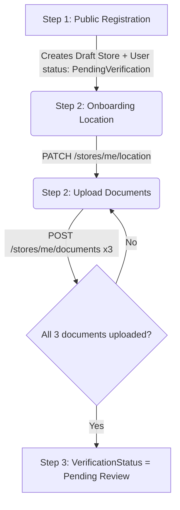

# FoodLoop Frontend Integration Guide — Sprint 1

Welcome! This guide outlines how to connect the React/Vite web dashboard and the Flutter mobile app to the FoodLoop Sprint 1 backend services.

---

## 1. Connection & Environments

* **Local Development Base URL**: `https://localhost:7238`
* **Content-Type**: All requests and responses use `application/json` (except document uploads, which use `multipart/form-data`).
* **CORS Config**: In local development, CORS is configured to dynamically allow **any** origin (e.g., `localhost:3000`, `localhost:5173`, etc.) and permits sending credentials.

---

## 2. Response Envelope

All API endpoints wrap their payload in a standard response envelope:

### Success Response
```json
{
  "success": true,
  "data": { ... },
  "message": null,
  "errors": []
}
```

### Error Response
```json
{
  "success": false,
  "data": null,
  "message": "A summary of what went wrong.",
  "errors": [
    "Specific validation detail 1.",
    "Specific validation detail 2."
  ]
}
```

---

## 3. Authentication & JWT Tokens

FoodLoop uses **short-lived Access Tokens** (15 minutes) and **long-lived, rotating Refresh Tokens** (30 days).

1. Send the `accessToken` in the `Authorization` header of all protected requests:
   ```http
   Authorization: Bearer <accessToken>
   ```
2. When a request returns `401 Unauthorized`, intercept it, use `/auth/refresh` to obtain a brand new access-and-refresh pair, and retry the original request.
3. **Replay Protection / Token Reuse Detection**: If a client attempts to use a *previously rotated* refresh token (a sign of compromise), the backend **immediately revokes all active sessions** for that user. Always overwrite your stored refresh token with the newly returned one immediately after a refresh call.

### Frontend Token Refresh Boilerplate

#### Axios Interceptor (React / Vite / Web)
```typescript
import axios from 'axios';

const api = axios.create({
  baseURL: 'https://localhost:7238',
});

// Attach access token
api.interceptors.request.use((config) => {
  const token = localStorage.getItem('accessToken');
  if (token) {
    config.headers.Authorization = `Bearer ${token}`;
  }
  return config;
});

// Auto-refresh on 401
api.interceptors.response.use(
  (response) => response,
  async (error) => {
    const originalRequest = error.config;
    if (error.response?.status === 401 && !originalRequest._retry) {
      originalRequest._retry = true;
      try {
        const refreshToken = localStorage.getItem('refreshToken');
        const res = await axios.post('https://localhost:7238/auth/refresh', { refreshToken });
        
        if (res.data.success) {
          const { accessToken, refreshToken: newRefreshToken } = res.data.data;
          localStorage.setItem('accessToken', accessToken);
          localStorage.setItem('refreshToken', newRefreshToken);
          
          originalRequest.headers.Authorization = `Bearer ${accessToken}`;
          return api(originalRequest);
        }
      } catch (refreshError) {
        // Token reuse or expired refresh token: force logout
        localStorage.clear();
        window.location.href = '/login';
        return Promise.reject(refreshError);
      }
    }
    return Promise.reject(error);
  }
);
```

#### Dio Interceptor (Flutter / Mobile)
```dart
import 'package:dio/dio.dart';

class AuthInterceptor extends Interceptor {
  final Dio dio = Dio(BaseOptions(baseUrl: 'https://localhost:7238'));

  @override
  void onRequest(RequestOptions options, RequestInterceptorHandler handler) {
    final token = getAccessTokenFromStorage();
    if (token != null) {
      options.headers['Authorization'] = 'Bearer $token';
    }
    handler.next(options);
  }

  @override
  void onError(DioException err, ErrorInterceptorHandler handler) async {
    if (err.response?.statusCode == 401) {
      final refreshToken = getRefreshTokenFromStorage();
      if (refreshToken != null) {
        try {
          final res = await dio.post('/auth/refresh', data: {'refreshToken': refreshToken});
          if (res.data['success'] == true) {
            final data = res.data['data'];
            saveTokensToStorage(data['accessToken'], data['refreshToken']);
            
            // Retry the original request
            final opts = err.requestOptions;
            opts.headers['Authorization'] = 'Bearer ${data['accessToken']}';
            final clone = await dio.request(
              opts.path,
              options: Options(method: opts.method, headers: opts.headers),
              data: opts.data,
              queryParameters: opts.queryParameters,
            );
            return handler.resolve(clone);
          }
        } catch (e) {
          // Token invalid/reused: logout and redirect to auth screen
          triggerLogoutFlow();
        }
      }
    }
    handler.next(err);
  }
}
```

---

## 4. API Specification — Sprint 1

### Module A: Authentication

#### 1. Register Account
* **Endpoint**: `POST /auth/register`
* **Access**: Public
* **Payload**:
  ```json
  {
    "name": "Sarah Ahmed",
    "email": "sarah@example.com",
    "password": "P@ssw0rd1!",
    "phoneNumber": "+201001234567",         // Optional for Consumer, required for Merchant
    "accountType": "User",                   // "User", "StoreOwner", or "Charity"
    "businessName": "Green Valley Groceries", // Required ONLY if StoreOwner or Charity
    "businessCategory": "Supermarket"        // Optional, e.g. "Supermarket", "Bakery"
  }
  ```
* **Notes**: If registering as a `StoreOwner` or `Charity`, the API automatically creates a draft `Store` instance behind the scenes linked to this account, and sets the user status to `PendingVerification`.

#### 2. Login
* **Endpoint**: `POST /auth/login`
* **Access**: Public
* **Payload**:
  ```json
  {
    "email": "sarah@example.com",
    "password": "P@ssw0rd1!"
  }
  ```

#### 3. Refresh Tokens
* **Endpoint**: `POST /auth/refresh`
* **Access**: Public
* **Payload**:
  ```json
  {
    "refreshToken": "hon3P3sUfhs8..."
  }
  ```

#### 4. Logout
* **Endpoint**: `POST /auth/logout`
* **Access**: Public (requires the refresh token to invalidate)
* **Payload**:
  ```json
  {
    "refreshToken": "hon3P3sUfhs8..."
  }
  ```

#### 5. Forgot Password
* **Endpoint**: `POST /auth/forgot-password`
* **Access**: Public
* **Payload**:
  ```json
  {
    "email": "sarah@example.com"
  }
  ```
* **Security Note**: This endpoint always returns `200 OK` with the message `"If that email is registered, a reset link has been sent."` regardless of whether the email exists in the database. This prevents account enumeration attacks.

#### 6. Reset Password
* **Endpoint**: `POST /auth/reset-password`
* **Access**: Public
* **Payload**:
  ```json
  {
    "email": "sarah@example.com",
    "token": "token-from-email",
    "newPassword": "NewP@ssw0rd1!"
  }
  ```

---

### Module B: Users & Settings

#### 1. Get Current User Info
* **Endpoint**: `GET /users/me`
* **Access**: Authenticated (Any Role)

#### 2. Update Profile
* **Endpoint**: `PATCH /users/me`
* **Access**: Authenticated (Any Role)
* **Payload**:
  ```json
  {
    "name": "Sarah S. Ahmed",                 // Optional
    "profileImage": "https://url.to/img.jpg", // Optional
    "preferredLanguage": "ar"                // Optional ("en" or "ar")
  }
  ```

#### 3. Update Preferences
* **Endpoint**: `PATCH /users/me/preferences`
* **Access**: Authenticated (Any Role)
* **Payload**:
  ```json
  {
    "orderUpdatesEnabled": true,            // Optional (Maps to "Order Updates" toggle)
    "marketingNotificationsEnabled": false, // Optional (Maps to "Latest Offers" toggle)
    "preferredLanguage": "en"               // Optional
  }
  ```

---

### Module C: Addresses

#### 1. Get Addresses
* **Endpoint**: `GET /users/me/addresses`
* **Access**: Authenticated (Any Role)
* **Response**: An array of addresses sorted with the default address first.

#### 2. Create Address
* **Endpoint**: `POST /users/me/addresses`
* **Access**: Authenticated (Any Role)
* **Payload**:
  ```json
  {
    "addressType": "Home",   // "Home" or "Company"
    "city": "Cairo",
    "district": "Maadi",
    "street": "Road 9",
    "buildingNo": "12",
    "floor": "3",            // Optional
    "apartmentNo": "5",      // Optional
    "notes": "Near metro",   // Optional
    "latitude": 30.0123,
    "longitude": 31.2345,
    "isDefault": true
  }
  ```
* **Constraint**: If `isDefault` is set to `true`, any existing default address for this user will automatically have its `isDefault` unset.

#### 3. Update Address
* **Endpoint**: `PATCH /users/me/addresses/{id}`
* **Access**: Authenticated (Owner of Address only)
* **Payload**: Any of the parameters from Create Address (e.g. `{"isDefault": true}`).

#### 4. Delete Address
* **Endpoint**: `DELETE /users/me/addresses/{id}`
* **Access**: Authenticated (Owner of Address only)

---

### Module D: Store Owner Verification Wizard

This covers the 3-step merchant onboarding wizard required before a store is allowed to publish listings.



#### 1. Onboarding Step 2 — Store Location
* **Endpoint**: `PATCH /stores/me/location`
* **Access**: Authenticated (Merchant Role)
* **Payload**:
  ```json
  {
    "governorate": "Cairo",
    "city": "Cairo",
    "neighborhood": "Al-Rawda",
    "street": "King Fahd Rd.",
    "latitude": 30.0123,  // Optional
    "longitude": 31.2345  // Optional
  }
  ```

#### 2. Onboarding Step 2 — Document Uploads
* **Endpoint**: `POST /stores/me/documents`
* **Access**: Authenticated (Merchant Role)
* **Headers**: `Content-Type: multipart/form-data`
* **Body Form Parameters**:
  * `type`: The document type. MUST be one of:
    * `"CommercialRegistration"`
    * `"TaxIdCertificate"`
    * `"StoreFacilityPhoto"`
  * `file`: The document file (binary).
* **Behavior**: If you upload a file for a slot that already has a document uploaded, the system overwrites the previous upload, resets its verification status back to `Pending`, and deletes the old physical file.

#### 3. Onboarding Step 3 — Get Current Store Status
* **Endpoint**: `GET /stores/me`
* **Access**: Authenticated (Merchant Role)
* **Response Details**:
  * Displays current verification details and list of uploaded documents.
  * **`verificationStatus`**:
    * `"Unverified"`: Default draft state.
    * `"Pending"`: Automatically flips to `Pending` once **all three** required documents have been uploaded successfully.
    * `"Verified"`: Stamped by Administrators upon review.
    * `"Rejected"`: Stamped by Administrators upon review.
